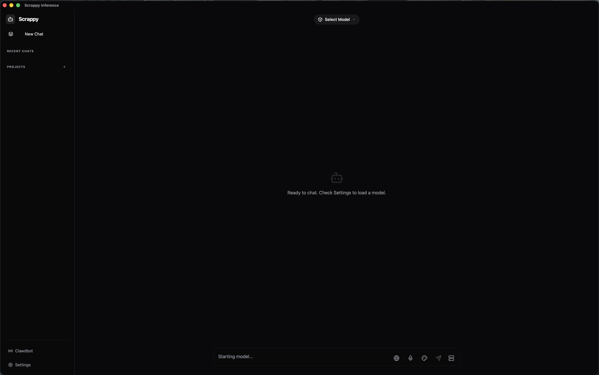
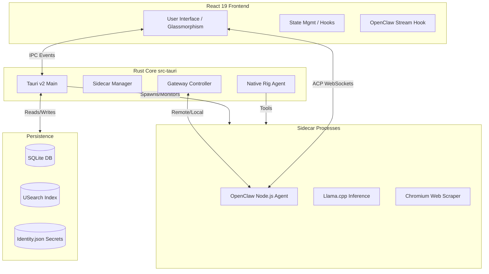

<p align="center">
  
</p>

# Scrappy: The Open-Source AI Command Center

Scrappy is a professional, open-source AI cockpit designed for executive-level workflows, privacy-focused developers, and power users. Built on a high-performance **Tauri v2 / Rust** backend, it features a dual-engine agent architecture: the **OpenClaw** Node.js engine for autonomous tasks and a **Native Rust Agent (Rig)** for high-efficiency RAG and search.



---

## Installation & Setup

For a deep dive into environment configuration, see the specialized **[macOS (Apple Silicon) Setup Guide](setup.md)**.

### 1. Requirements
- **macOS / Linux / Windows** (Tauri v2 compatible).
- **Node.js 22.x+** and **npm**.
- **Rust (Stable)**.

### 2. Quick Start (macOS)
```bash
# 1. Install project dependencies
npm install
npm run setup:moltbot

# 2. Automated sidecar initialization (Node, Chromium, AI)
npm run setup:all

# 3. Launch in Developer Mode
npm run tauri dev
```

### 3. Setup Advice
- **Secrets**: Go to **Settings > Secrets** to add your API keys. Scrappy now supports **Anthropic**, **OpenAI**, **Google Gemini**, **Groq**, **OpenRouter**, and **Brave Search**. Remember to toggle "Grant Access" for each key to enable them for the agent.
- **Custom Secrets**: You can now add arbitrary custom secrets for specialized agent workflows.
- **Hugging Face**: A **Hugging Face Read Token** is highly recommended. It may be required on first launch to download gated LLMs (like Llama/Gemma) or specialized diffusion models. You can add this in **Settings > Secrets**.
- **Models**: Download GGUF models and point Scrappy to them in **Settings > Models**.

---

## Vision & Key Capabilities

*   **OpenClaw Agent Architecture**: Full implementation of the OpenClaw streaming protocol, enabling agents to plan, execute tools, and reflect in real-time.
*   **Native Rust Agency (Rig)**: A high-performance agent built on `rig-core` for specialized RAG, deep web search, and visual asset generation.
*   **Autonomous Agency**: The `OpenClaw Agent` ecosystem enables human-in-the-loop agents that can execute shell commands, manage files, and browse the web.
*   **Custom Secrets & Privacy**: Securely manage Anthropic, OpenAI, Gemini, Groq, OpenRouter, and custom API keys with granular "Grant Access" controls.
*   **Hybrid Inference Engine**: Seamlessly switch between local GGUF models (Llama 3, Gemma 3) and bleeding-edge cloud models (GPT-5.2, Claude 4.5) in a single workflow.
*   **Standalone Gateway Support**: Connect to local OpenClaw sidecars or remote gateways for distributed agent control.
*   **Imagine Studio**: A dedicated creative suite for image generation with custom bespoke icons, multiple provider support (Local Diffusion, Gemini Imagen 3), and a high-performance integrated **Gallery** with real-time generation progress tracking, horizontal recent-generations strip, and settings restoration support.
*   **Human-in-the-Loop (HITL)**: Advanced security protocols that pause execution for explicit user approval of high-risk shell commands.
*   **Knowledge OS (RAG)**: Enterprise-grade retrieval pipeline with vector search (`usearch`), ONNX reranking, and citation-backed generation.
*   **Web Intelligence**: Deep web scraping via bundled Chromium and real-time news search via Brave Search.
*   **Spotlight Command Bar**: An ultra-fast, system-wide AI overlay for quick queries, neural lookups, and rapid brain access (`Cmd+Shift+K`).

---

## Spotlight: Global AI Access

Scrappy includes a premium **Spotlight Bar**—a glassmorphic, system-wide interface that brings the power of your neural engine to any application.

-   **Instant Summon**: Press `Cmd + Shift + K` (macOS) to toggle the Spotlight bar from anywhere.
-   **Neural Status**: A biological status indicator shows your brain state in real-time (Green = Active/Local Brain Online, Gray = Inactive).
-   **Transient Intelligence**: Optimized for "quick-tap" queries. By default, Spotlight sessions are purged upon closing to keep your primary history clean and focused.
-   **Hotkeys**:
    -   `Cmd + L`: Purge the current spotlight session and start fresh.
    -   `Esc`: Hide the bar instantly.
    -   `Enter`: Send prompt.
    -   `Shift + Enter`: Multi-line input.

---

## Technical Architecture

Scrappy uses a **Modular Sidecar Architecture**. The Rust core orchestrates several specialized processes to keep the main application lightweight and responsive.



### 1. The OpenClaw Engine
The heart of Scrappy's autonomous agency. Based on the **Pi agent runtime**, it executes an iterative **Think-Act-Observe** loop:
-   **Session Management**: Each conversation has a dedicated "lane" and JSONL transcript.
-   **Tool System**: Built-in tools for `exec` (shell), `file_io`, `browser`, and `skill` extensions.
-   **Streaming Response**: Real-time streaming of tokens, tool inputs, and internal "thinking".

### 2. The Native Rust Agent (`src-tauri/src/rig_lib`)
A specialized agent engine built using **Rig**. It focuses on performance and reliability for core features:
-   **RAG Integration**: Direct access to the `usearch` vector store for context injection.
-   **Deep Search**: Utilizes `DDGSearchTool` and `ScrapePageTool` for gathering real-time information.
-   **Image Generation**: Native integration with image generation sidecars via `ImageGenTool`, featuring a premium studio interface with real-time progress tracking, style presets, and multi-resolution support (512px to 2K).

---

## OpenClaw Configuration & Lifecycle

OpenClaw is highly configurable through a combination of system files and workspace-level markdown instructions.

### 1. System Infrastructure
These files handle the mechanical aspects of the agent:
- **`identity.json`**: (`~/Library/Application Support/com.schack.scrappy/Clawdbot/state/identity.json`) - Your persistent device ID, auth token, and API keys for Cloud Providers.
- **`openclaw.json`**: Core runtime config defining the gateway port (default `18789`), model providers, and channel settings.
- **`auth-profiles.json`**: Secure storage for API keys that the agent is permitted to use, including Brave Search and Custom Secrets.

### 2. Workspace Markdown (The Agent's "Brain")
The agent's personality and rules are defined by markdown files in its workspace. These are injected into the system prompt on session start:
- **`AGENTS.md`**: Core operational manual. Covers memory usage, group chat etiquette, and interaction rules (e.g., avoiding multiple responses to the same input).
- **`SOUL.md`**: Defines your agent's persona, values, and fundamental behavior.
- **`IDENTITY.md`**: High-level identity markers like name, "creature type," and signature emoji.
- **`USER.md`**: Stores what the agent knows about *you* (name, preferences, context).
- **`TOOLS.md`**: Practical conventions for tool usage (camera names, SSH details, shell preferences).

### 3. Lifecycle & Automation
- **`BOOTSTRAP.md`**: A one-time setup ritual performed by the agent in a new workspace.
- **`BOOT.md`**: Startup checklist executed every time the gateway/agent restarts.
- **`HEARTBEAT.md`**: A proactive, periodic checklist for automated tasks (e.g., checking weather, emails, or project status every 30 minutes).

### 4. Management & Visibility
- **Settings Tab**: Manage API keys, model selection, gateway connection modes, and customize your **Spotlight Global Shortcut**.
- **Persona Editing**: Modify `.md` files in the workspace directory to refine the agent's behavior in real-time. For built-in personas, you can find the prompt definitions in `src-tauri/src/personas.rs`.
- **Logs/Transcripts**: Full interaction logs and tool histories are stored as JSONL in `Clawdbot/agents/main/sessions/`.

### 5. Cloud Inference Providers
Scrappy 2026 features native integration with the world's most powerful inference engines:
- **Anthropic**: Support for **Claude 4.5 Sonnet** and **Opus** with native Tool Use.
- **OpenAI**: First-class support for **GPT-5.2** (with specialized reasoning) and **GPT-4o** variants.
- **Google Gemini**: Integrated **Gemini 2.0/3.0 Flash/Pro** with support for massive 1M+ token contexts.
- **Groq**: Ultra-fast inference for open models like **Llama 3.3 70B** and **Mixtral**.
- **OpenRouter**: Gateway access to 100+ specialized models via a single API key.
- **Custom Secrets**: Define and grant access to any external API key for use in custom agent tools.

---

## Project Structure

### Backend (`src-tauri/`)
-   `src/clawdbot/`: OpenClaw gateway logic and session orchestration.
-   `src/rig_lib/`: Implementation of the Native Rust Agent and its specialized tools.
-   `src/sidecar.rs`: The manager for all background binaries (Node, Llama, Chromium).
-   `src/templates.rs`: Prompt templates (ChatML, Llama3, Mistral) used for model formatting.
-   `documentation/openclaw/`: Architectural deep-dives into the agent memory and tool systems.

### Frontend (`src/`)
-   `components/chat/`: The high-performance chat interface.
-   `components/openclaw/`: Visualizations for agent status and tool execution.
-   `hooks/use-openclaw-stream.ts`: Real-time agent event processing.

---

## Developer Guide: Extending Scrappy

### Adding a New Prompt Template
Templates are defined in `src-tauri/src/templates.rs`. To add one:
1.  Define a new `pub const` with your Jinja-like template.
2.  Add it to the renderer logic in the model manager.

### Adding a New OpenClaw Tool
Tools are implemented in the **OpenClaw** engine:
1.  Create a tool definition with a JSON schema in the OpenClaw skill directory.
2.  Implement the `execute` logic (Node.js).
3.  The UI will automatically handle rendering based on the ACP metadata.

### Adding a Native Rust Tool (Rig)
1.  Implement the `Tool` trait in `src-tauri/src/rig_lib/tools/`.
2.  Register the tool in `RigManager::new` within `src-tauri/src/rig_lib/agent.rs`.
3.  Ensure the tool emits progress events to the UI if long-running.

---

## Security & Safety Philosophy

1.  **Strict Local-First**: Your data and AI transcripts stay on your machine.
2.  **Isolated Secrets**: API keys are only injected into the agent environment when explicitly allowed.
3.  **Human Governance**: Every dangerous command triggers a UI approval request.
4.  **Sandbox Ready**: Tool execution can be configured to run in Docker containers.

---

## Contributing & Community

Scrappy is an evolving platform. We welcome contributions to the RAG pipeline, new agent skills, or UI refinements.

1.  Explore the `documentation/openclaw/` folder for architectural deep-dives.
2.  Check the `src-tauri/src/clawdbot/commands.rs` and `rig_lib/agent.rs` for backend extension points.

---

## License

Distributed under the **GNU General Public License v3.0** (Strong Copyleft). See `License.md` for more information and attribution requirements.
