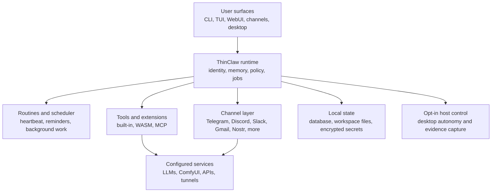

<p align="center">
  
</p>

<h1 align="center">ThinClaw</h1>

<p align="center">
  <strong>A self-hosted AI collaborator for real work: private, durable, and built to keep moving.</strong>
</p>

<p align="center">
  <a href="https://github.com/RNT56/ThinClaw/releases"></a>
  &nbsp;
  <a href="#project-status"></a>
  &nbsp;
  <a href="https://github.com/RNT56/ThinClaw/actions/workflows/ci.yml"></a>
  &nbsp;
  <a href="https://github.com/RNT56/ThinClaw/blob/main/LICENSE-MIT"></a>
</p>

<p align="center">
  <a href="#quick-start"></a>&nbsp;
  <a href="#philosophy"></a>&nbsp;
  <a href="#personality-that-adapts"></a>&nbsp;
  <a href="#what-you-can-use-it-for"></a>&nbsp;
  <a href="#install-options"></a>&nbsp;
  <a href="#security-and-trust"></a>&nbsp;
  <a href="#documentation-map"></a>&nbsp;
  <a href="#development"></a>
</p>

---

## Quick Start

### macOS / Linux

```bash
curl --proto '=https' --tlsv1.2 -LsSf \
  https://github.com/RNT56/ThinClaw/releases/latest/download/thinclaw-installer.sh | sh

thinclaw onboard
thinclaw
```

Open the local gateway after startup:

```text
http://127.0.0.1:3000
```

If your shell cannot find `thinclaw` immediately after install, open a new
terminal or add `~/.local/bin` to your `PATH`.

Try one useful loop:

```text
Remember that this machine is my personal ThinClaw node.
Summarize what you can do from this environment.
Create a follow-up reminder to review setup tomorrow.
```

The point is not the prompt. The point is that ThinClaw has somewhere to put
memory, a runtime that can keep operating, and surfaces you can return to later.

### Windows

Install the latest MSI or portable ZIP from
[GitHub Releases](https://github.com/RNT56/ThinClaw/releases), then run:

```powershell
thinclaw onboard
thinclaw
```

### Remote Hosts

For a Mac Mini, Raspberry Pi, VPS, or another always-on host:

```bash
thinclaw onboard --profile remote
thinclaw gateway access
thinclaw service install
thinclaw service start
```

Use [docs/DEPLOYMENT.md](docs/DEPLOYMENT.md) for the full deployment decision
tree.

## What Is ThinClaw?

Your AI assistant should not vanish when the tab closes.

ThinClaw is a practical, privacy-respecting AI collaborator for real work. It
keeps a durable identity, remembers useful context, runs approved tools,
connects to channels, schedules routines, and stays inside policy you control.

Run it on your laptop, a Mac Mini, a Raspberry Pi, a VPS, or inside ThinClaw
Desktop. Talk to the same agent from the terminal, full-screen TUI, web gateway,
chat channels, desktop app, or background jobs. Same identity. Same memory. Same
rules.

> ThinClaw is for people who want an agent with a home address, not another
> disposable chat thread.

Put it on a machine you trust. Connect the services you actually use. Let it
remember project facts, follow up, watch routine work, and report back through
the surface you already have open. ThinClaw is not a chatbot you revisit. It is
an agent you come back to.

## Project Status

ThinClaw is under active development. The CLI, TUI, gateway, memory, routines,
tools, channels, and deployment paths are usable, but this is still a preview
runtime for people who are comfortable operating their own agent stack.

Some surfaces are intentionally marked experimental:

- ThinClaw Desktop is a companion app under active development.
- Reckless desktop autonomy is an explicit privileged mode for machines and
  accounts you intentionally grant host-level control to.
- External integrations such as MCP servers, ComfyUI, tunnels, LLM providers,
  and chat platforms are real trust boundaries, not magic sandboxes.

## Philosophy

ThinClaw is built around one belief: a useful agent needs a place to live.

Hosted chat is convenient, but it is usually session-shaped. Scripts and cron
are durable, but they are scattered and brittle. ThinClaw sits between those
worlds: one self-hosted runtime for memory, routines, tools, channels,
notifications, and policy.

| The Need | ThinClaw's Answer |
|---|---|
| Chat that survives the session | Durable identity, memory, workspace context, and continuity commands |
| Automation that is not scattered | Routines, heartbeat, jobs, channels, notifications, and tools in one runtime |
| AI that can touch real systems carefully | Explicit trust boundaries for secrets, tools, code, network access, and desktop control |
| A private agent stack | Local or self-hosted deployment with your providers, your data paths, and your policies |
| Extensibility without chaos | Native integrations for trusted host work, sandboxed WASM for scoped components, and MCP for external ecosystems |

## Capabilities At A Glance

| Area | What ThinClaw Gives You |
|---|---|
| Private runtime | Local or self-hosted operation, OS secure-store support, explicit data paths, and operator-owned policy |
| Durable memory | Workspace-backed memory, identity files, search, citations, `/compress`, `/summarize`, and session continuity |
| Real tools | Built-in tools, packaged WASM tools and channels, MCP servers, native integrations, and ComfyUI media workflows |
| Background work | Routines, heartbeat, schedules, reminders, job logs, notifications, follow-ups, and service mode |
| Many surfaces | CLI, TUI, web gateway, native channels, WASM channels, desktop app, background jobs, and remote access |
| Trust boundaries | Sandboxed WASM paths, operator-trusted MCP and sidecars, mode-aware execution, and security docs that spell out limits |

## Architecture At A Glance



| Component | Purpose |
|---|---|
| Runtime | Holds the agent identity, policy, memory access, job coordination, and surface routing |
| Gateway | Browser UI for chat, memory, routines, logs, extensions, providers, projects, skills, and settings |
| Scheduler | Keeps routines, reminders, heartbeat work, and background jobs moving |
| Tool system | Runs built-in tools, WASM extensions, MCP servers, and trusted host integrations |
| Channel layer | Connects the same agent to terminal, web, chat, mail, and app surfaces |
| Security layer | Makes execution mode, secret handling, network access, and trust boundaries visible |

## What You Can Use It For

| Use Case | What ThinClaw Lets You Do |
|---|---|
| Personal operations agent | Keep routines, reminders, logs, service checks, and notifications close to the machine that owns them |
| Project memory | Give an agent continuity across repos, docs, sessions, and long investigations |
| Adaptable working partner | Shift between balanced, professional, creative, research, mentor, minimal, technical, playful, and custom modes |
| Channel-native assistant | Talk to the same agent through terminal, WebUI, Telegram, Discord, Slack, Gmail, Nostr, and more |
| Remote command center | Run ThinClaw on a Mac Mini, Raspberry Pi, VPS, or workstation and reach it through a gateway or chat channel |
| Local media lab | Connect ComfyUI for image generation, workflow health checks, dependency checks, and generated-media artifacts |
| Controlled desktop autonomy | Opt into host-level UI automation with evidence capture, approval boundaries, rollout, and rollback |

## Personality That Adapts

ThinClaw has a durable character, not a locked costume. Its base identity lives
in a canonical soul: practical, discreet, candid, warm, and outcome-driven. That
identity travels across projects and surfaces so the same agent can meet you in
the terminal, WebUI, chat channels, or background work without becoming a new
stranger every time.

You can then shape how it shows up.

| Layer | What It Does |
|---|---|
| Durable soul | The long-lived core: privacy, trust, helpfulness, continuity, and operating principles |
| Personality pack | The initial flavor chosen during setup, such as balanced, professional, mentor, or flow state |
| `/personality` overlay | A temporary session tone or working mode without rewriting the durable identity |
| Workspace identity files | Project-specific context through `IDENTITY.md`, `USER.md`, `AGENTS.md`, and optional local overlays |

Built-in personality packs include:

| Pack | Best For |
|---|---|
| `balanced` | Grounded everyday collaboration |
| `professional` | Crisp workplace-ready support |
| `creative_partner` | Lateral thinking, drafts, naming, ideation, and creative direction |
| `research_assistant` | Evidence-first synthesis, careful uncertainty, and source-driven work |
| `mentor` | Patient guidance, explanations, and skill-building |
| `minimal` | Terse answers, low ceremony, and quiet competence |
| `flow_state` | Composed intensity, momentum, sharper taste, and receipts |

Session overlays let you shift tone on demand:

```text
/personality concise
/personality technical
/personality playful
/personality eli5
/personality reset
```

The overlay changes voice, density, and collaboration style. It does not relax
privacy, consent, permissions, or safety boundaries.

## Why Not Just Hosted Chat Or Scripts?

| If You Need | Hosted Chat | Scripts And Cron | ThinClaw |
|---|---|---|---|
| One durable agent identity | Product-dependent | Manual | Built in |
| Memory across surfaces | Limited | Manual | Built in |
| Local or self-hosted control | No | Yes | Yes |
| Channels, routines, tools, and jobs together | Limited | Fragmented | Built in |
| Explicit trust boundaries | Product-dependent | Manual | Built in |
| A runtime that can grow with you | No | Hard to maintain | Yes |

## Who It Is For

- People who want a personal AI runtime they can run on their own machines.
- Builders who want memory, tools, routines, channels, and policy in one place.
- Operators who care where secrets live and which systems an agent can touch.
- Teams experimenting with self-hosted agent infrastructure instead of another
  hosted chat wrapper.

## Who It Is Not For

- You only want a zero-configuration hosted chatbot.
- You do not want to connect providers, secrets, channels, or local services.
- You do not want to think about trust boundaries for real tools.
- You need a finished pure SaaS product with no operator-owned runtime.

## Run Modes

| Mode | Best For | Start Here |
|---|---|---|
| Local CLI | Personal local runtime, development, direct terminal use | `thinclaw` |
| Full-screen TUI | Keyboard-first local agent cockpit | `thinclaw tui` |
| Web gateway | Browser-based chat, memory, routines, logs, extensions, providers, and settings | [docs/DEPLOYMENT.md](docs/DEPLOYMENT.md) |
| Service mode | Long-running host, Mac Mini, VPS, Raspberry Pi, Windows service | [docs/deploy/](docs/deploy/) |
| Native channels | Signal, Discord, Matrix, Nostr, Gmail, iMessage, BlueBubbles, Apple Mail, voice-call, APNs, browser-push (Telegram and Slack are WASM packages) | [docs/CHANNEL_ARCHITECTURE.md](docs/CHANNEL_ARCHITECTURE.md) |
| WASM channels and tools | Packaged, capability-scoped extension components | [docs/EXTENSION_SYSTEM.md](docs/EXTENSION_SYSTEM.md) |
| ComfyUI media generation | Prompt-to-image, workflow execution, and managed local/cloud ComfyUI setup | [docs/COMFYUI_MEDIA_GENERATION.md](docs/COMFYUI_MEDIA_GENERATION.md) |
| ThinClaw Desktop | Experimental desktop companion app embedding ThinClaw as a local or remote runtime | [apps/desktop/README.md](apps/desktop/README.md) |
| Reckless desktop autonomy | Operator-approved host-level desktop automation | [docs/DESKTOP_AUTONOMY.md](docs/DESKTOP_AUTONOMY.md) |

## Host Support Matrix

| Host Surface | macOS | Linux | Windows |
|---|---|---|---|
| Local CLI / gateway host | Supported | Supported | Supported |
| Native OS secure store | Supported | Supported | Supported |
| `thinclaw service` lifecycle | Supported | Supported | Supported |
| Local browser automation | Chrome / Brave / Edge | Chrome / Chromium / Brave / Edge | Chrome / Edge / Brave |
| Docker browser fallback | Supported | Supported | Docker Desktop |
| Camera / microphone capture | Supported | Supported | Supported with `ffmpeg` |
| Signal attachments | Supported | Supported | Supported, override with `SIGNAL_ATTACHMENTS_DIR` when needed |
| Apple Mail / iMessage native adapters | Supported | Unsupported | Unsupported |
| iMessage via BlueBubbles | Supported | Supported | Supported |

## Security And Trust

ThinClaw aims for operator control, but it does not claim every configured
integration is equally isolated.

| Extension Path | Trust Model | Used For |
|---|---|---|
| Native Rust | Trusted host runtime | Persistent connections, local-system access, and built-in integrations |
| WASM tools | Sandboxed and capability-scoped | Hot-reloadable tool components with credential isolation |
| WASM channels | Sandboxed and capability-scoped | Packaged channel components with explicit host capabilities |
| MCP servers | Operator-trusted external process or service | External tool ecosystems and services managed outside the sandbox |
| ComfyUI sidecar | Operator-trusted local or cloud media runtime | Image generation, workflow execution, model/node lifecycle actions |
| Desktop autonomy | Privileged opt-in profile | Host-level app control, UI automation, evidence capture, rollout, and rollback |

Important boundaries:

- Local data paths, secrets, and policy enforcement live in the trusted host
  runtime.
- WASM components are sandboxed and capability-scoped.
- MCP servers, ComfyUI sidecars, tunnels, LLM providers, and external services
  are real trust boundaries.
- Docker remains the portable hard-isolation path for code execution; host-local
  isolation reports its actual backend and capabilities.
- `desktop_autonomy.profile = "reckless_desktop"` adds host-level app, UI, and
  screen control plus managed code promotion and rollback.

Read the deep docs before relying on a surface for sensitive workflows:

- [docs/SECURITY.md](docs/SECURITY.md)
- [docs/DESKTOP_AUTONOMY.md](docs/DESKTOP_AUTONOMY.md)
- [src/NETWORK_SECURITY.md](src/NETWORK_SECURITY.md)
- [docs/EXTENSION_SYSTEM.md](docs/EXTENSION_SYSTEM.md)
- [docs/COMFYUI_MEDIA_GENERATION.md](docs/COMFYUI_MEDIA_GENERATION.md)
- [docs/CHANNEL_ARCHITECTURE.md](docs/CHANNEL_ARCHITECTURE.md)

## Install Options

GitHub Releases are the normal path. The installer downloads a prebuilt binary,
verifies its SHA256 checksum, and installs `thinclaw` into `~/.local/bin` by
default:

```bash
curl --proto '=https' --tlsv1.2 -LsSf \
  https://github.com/RNT56/ThinClaw/releases/latest/download/thinclaw-installer.sh | sh
```

For Pi, VPS, SD-card, and other small-machine installs, use the edge artifact:

```bash
curl --proto '=https' --tlsv1.2 -LsSf \
  https://github.com/RNT56/ThinClaw/releases/latest/download/thinclaw-installer.sh | sh -s -- --profile edge
```

Release artifacts publish the regular `full` binary for supported Linux, macOS,
and Windows targets, plus Linux `edge` artifacts for small machines.

Source builds, feature profiles, and maintainer workflows live in
[docs/DEVELOPMENT.md](docs/DEVELOPMENT.md).

## Useful Commands

| Task | Command |
|---|---|
| Run onboarding | `thinclaw onboard` |
| Start the local runtime | `thinclaw` |
| Start the full-screen runtime | `thinclaw tui` |
| Force full-screen onboarding | `thinclaw onboard --ui tui` |
| Reset local ThinClaw state | `thinclaw reset --yes` |
| Show verbose startup logs | `thinclaw --debug --no-onboard` |
| Show verbose `run` logs | `thinclaw --debug run --no-onboard` |

`thinclaw` and `thinclaw run` share the same quiet startup path by default. For
targeted log filtering, `RUST_LOG=...` still takes precedence.

## Documentation Map

| Need | Start Here |
|---|---|
| Audience-first docs index | [docs/README.md](docs/README.md) |
| Deployment decision tree | [docs/DEPLOYMENT.md](docs/DEPLOYMENT.md) |
| ComfyUI image generation | [docs/COMFYUI_MEDIA_GENERATION.md](docs/COMFYUI_MEDIA_GENERATION.md) |
| Platform runbooks | [docs/deploy/](docs/deploy/) |
| CLI command reference | [docs/CLI_REFERENCE.md](docs/CLI_REFERENCE.md) |
| LLM provider setup | [docs/LLM_PROVIDERS.md](docs/LLM_PROVIDERS.md) |
| Security and trust overview | [docs/SECURITY.md](docs/SECURITY.md) |
| Deep network model | [src/NETWORK_SECURITY.md](src/NETWORK_SECURITY.md) |
| Extensions, WASM, MCP, and registries | [docs/EXTENSION_SYSTEM.md](docs/EXTENSION_SYSTEM.md) |
| Channel architecture | [docs/CHANNEL_ARCHITECTURE.md](docs/CHANNEL_ARCHITECTURE.md) |
| Shared surface commands | [docs/SURFACES_AND_COMMANDS.md](docs/SURFACES_AND_COMMANDS.md) |
| Terminal and WebUI skins | [docs/TERMINAL_SKINS.md](docs/TERMINAL_SKINS.md) |
| Identity and personality | [docs/IDENTITY_AND_PERSONALITY.md](docs/IDENTITY_AND_PERSONALITY.md) |
| Memory and growth surfaces | [docs/MEMORY_AND_GROWTH.md](docs/MEMORY_AND_GROWTH.md) |
| Research and experiments | [docs/RESEARCH_AND_EXPERIMENTS.md](docs/RESEARCH_AND_EXPERIMENTS.md) |
| Contributor workflow | [docs/DEVELOPMENT.md](docs/DEVELOPMENT.md) |

## Development

Contributor setup, source builds, local checks, feature profiles, and release
build details live in [docs/DEVELOPMENT.md](docs/DEVELOPMENT.md). Build-profile
details are tracked in [docs/BUILD_PROFILES.md](docs/BUILD_PROFILES.md).

When moving code between workspace crates, also run the structural checks in
[docs/CRATE_OWNERSHIP.md](docs/CRATE_OWNERSHIP.md); CI rejects internal crates
that import or depend on the root `thinclaw` package.

## License

Licensed under either of:

- MIT License ([LICENSE-MIT](LICENSE-MIT))
- Apache License, Version 2.0 ([LICENSE-APACHE](LICENSE-APACHE))
