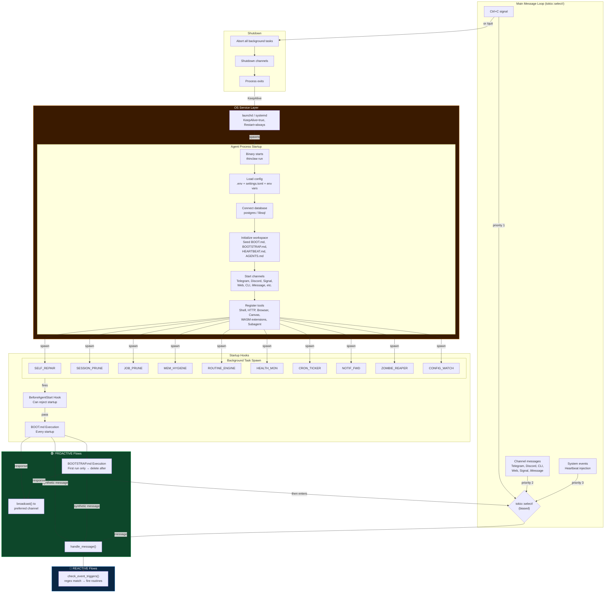
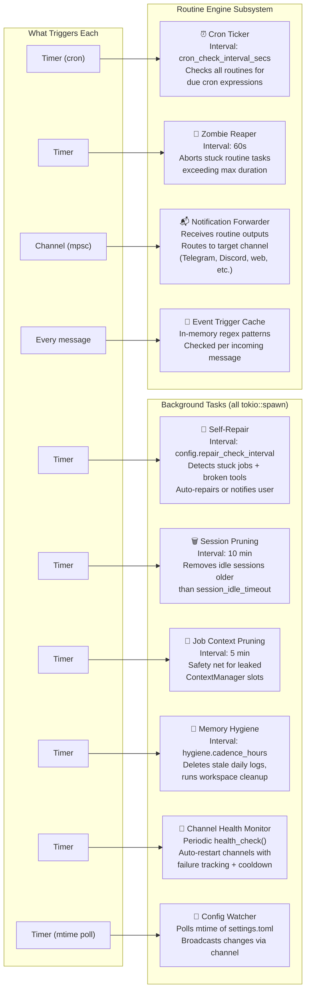
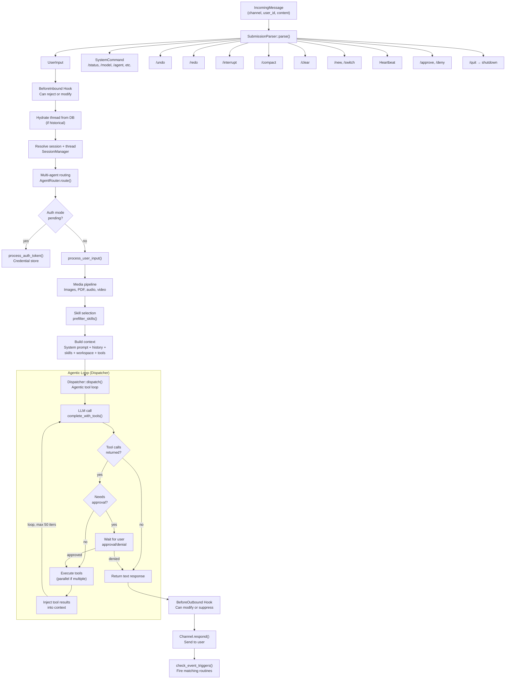
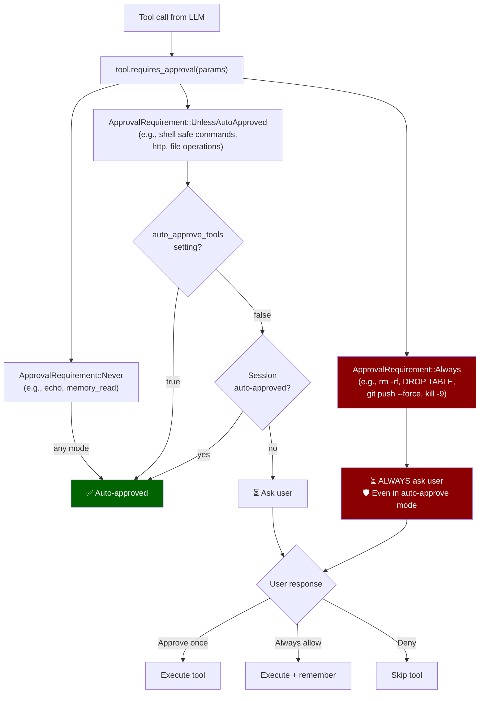
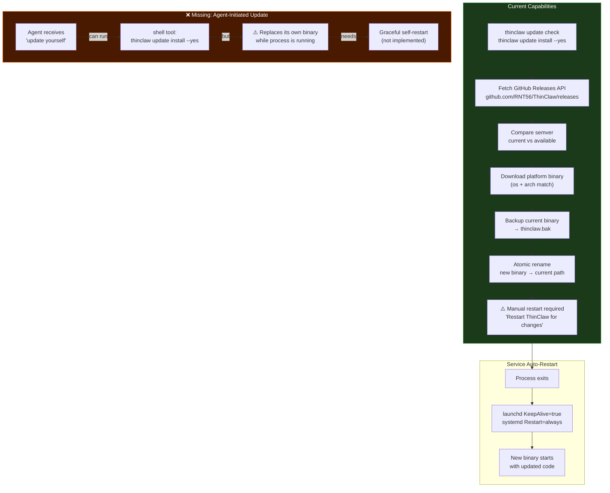
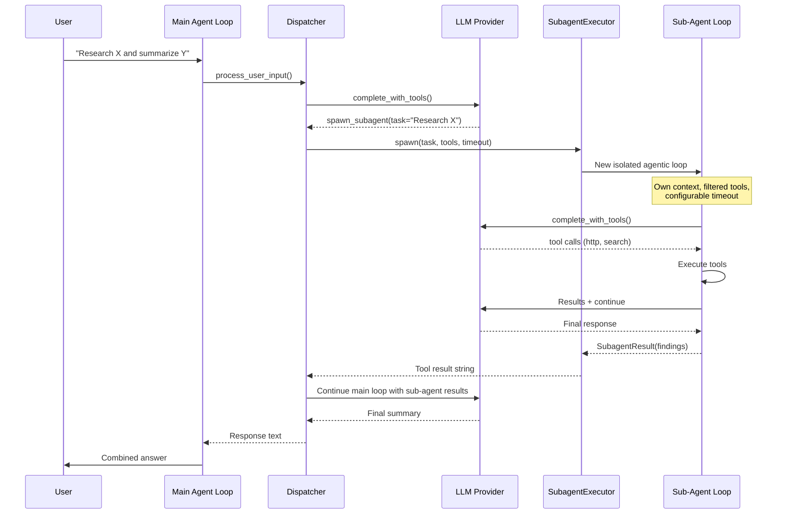

# ThinClaw Agent Flows — Complete Architecture

> **Generated:** 2026-03-25 11:46 CET

---

## Master Agent Flow Diagram



---

## Background Subprocess Map



---

## Message Processing Pipeline



---

## Tool Approval Decision Flow



---

## All Proactive vs Reactive Flows

| # | Flow | Type | Trigger | Frequency | Target |
|---|------|------|---------|-----------|--------|
| 1 | **BOOT.md** | 🟢 Proactive | Agent process starts | Every startup | Preferred notification channel |
| 2 | **BOOTSTRAP.md** | 🟢 Proactive | First run (file exists) | Once (deleted after) | Preferred notification channel |
| 3 | **Heartbeat** | 🟢 Proactive | Cron schedule (routine engine) | Configurable (e.g. every 6h) | Heartbeat notify channel |
| 4 | **Cron routines** | 🟢 Proactive | Cron expressions | Per schedule | Routine notify channel |
| 5 | **Event-triggered routines** | 🟠 Reactive-Proactive | Regex match on incoming messages | Per matching message | Routine notify channel |
| 6 | **Self-repair notifications** | 🟢 Proactive | Stuck job / broken tool detected | On detection | Web channel |
| 7 | **Channel health restart** | 🟢 Proactive | Channel health check fails | On failure + cooldown | Internal (auto-restart) |
| 8 | **Memory hygiene** | 🟢 Proactive | Timer (cadence_hours) | Periodic | Internal (workspace cleanup) |
| 9 | **Session pruning** | 🟢 Proactive | Timer (10 min) | Every 10 min | Internal (memory cleanup) |
| 10 | **Config hot-reload** | 🟢 Proactive | File mtime change | On change | Internal (log + restart hint) |
| 11 | **User message** | 🔵 Reactive | User sends text via channel | On demand | Same channel |
| 12 | **System command** | 🔵 Reactive | User sends /command | On demand | Same channel |
| 13 | **Tool approval** | 🔵 Reactive | Agent needs approval | On demand | Same channel |
| 14 | **Auth token** | 🔵 Reactive | Extension needs credentials | On demand | Same channel |
| 15 | **Sub-agent spawn** | 🔵 Reactive | Main agent spawns sub-agent | During tool execution | Internal → main agent |
| 16 | **Webhook inbound** | 🔵 Reactive | External HTTP POST | On demand | Agent loop via inject_tx |

---

## Self-Update Architecture



---

## Can the Agent "Update Itself"?

### Short Answer: **Partially — it can update the binary but cannot gracefully restart itself yet.**

### What Works Today

1. **`thinclaw update check`** — Fetches latest release from `https://api.github.com/repos/RNT56/ThinClaw/releases`, compares semver, shows what's available ([update.rs](file:///Users/vespian/coding/ThinClaw-main/src/cli/update.rs#L233-L267))

2. **`thinclaw update install --yes`** — Downloads the platform binary from GitHub Releases, backs up the current binary to `thinclaw.bak`, and atomically replaces the running binary ([update.rs](file:///Users/vespian/coding/ThinClaw-main/src/cli/update.rs#L269-L343))

3. **`thinclaw update rollback`** — Restores from backup if something goes wrong ([update.rs](file:///Users/vespian/coding/ThinClaw-main/src/cli/update.rs#L345-L357))

4. **Service auto-restart** — If ThinClaw is installed as a service (`thinclaw service install`), the launchd plist has `KeepAlive=true` and the systemd unit has `Restart=always`. So if the process exits, the OS will restart it with the new binary ([service.rs](file:///Users/vespian/coding/ThinClaw-main/src/service.rs#L66-L98))

### What's Missing

| Gap | Impact | Fix Required |
|-----|--------|-------------|
| **No graceful self-restart** | Agent can replace its binary via shell tool, but can't trigger a clean process restart from within | Add `/restart` command or `restart_self()` that does orderly shutdown → exec() |
| **Source build not supported** | `thinclaw update install` downloads **pre-built binaries** from GitHub Releases, not source. If no release binary exists for the user's platform, the update fails | Need `git pull` + `cargo build --release` fallback for source installs |
| **No auto-update check** | Agent never proactively checks for updates | Could add to BOOT.md or heartbeat |
| **Shell tool safety** | `thinclaw update install --yes` runs fine, but asking the agent to do `git pull && cargo build` would work if the source is available and cargo is in PATH | Already possible in autonomous mode |

### If You Asked the Agent "Update Yourself"

With the current code, here's what would happen:

1. **In autonomous mode** (`auto_approve_tools = true`): The agent would likely run `thinclaw update check` via its shell tool — this would succeed and show available updates. It could then run `thinclaw update install --channel stable --yes` which would:
   - Download the new binary ✅
   - Replace the current binary ✅
   - Print "Restart ThinClaw for changes to take effect" ⚠️
   - **But the agent is still running the old binary in memory** — it needs a process restart

2. **With service installed**: If `thinclaw service install` was run, the agent could then run `kill -TERM $$` or just `exit 0` — the OS service manager would restart the process with the new binary. **However**, `kill` matches `NEVER_AUTO_APPROVE_PATTERNS` so it would require manual approval even in autonomous mode 🛡️

3. **Without service**: The process would need to be manually restarted, or the agent could exec() itself (not implemented).

### Recommendation

To make "update yourself" work end-to-end, you'd need:

```
1. thinclaw update install --yes   ← already works
2. Graceful self-restart            ← needs implementation
   Option A: exec() syscall (replaces process in-place)
   Option B: /restart command → orderly shutdown + launchd/systemd picks it up
```

**Option B** is the safer approach and already works if the service is installed—the agent just needs a `/restart` command that does a clean shutdown (which the OS service layer will detect and restart).

---

## Sub-Agent Flow


