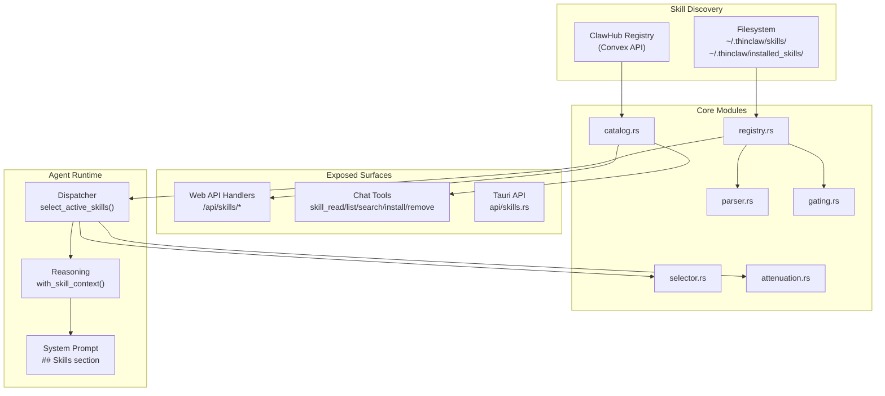

# Agent Skill System — End-to-End Audit

> Comprehensive analysis of the Skill system architecture, implementation, exposed surfaces, external sources, and identified gaps.

---

## 1. Architecture Overview

The Skill system is a **prompt-level extensibility framework** that lets users extend the agent's behavior by loading `SKILL.md` files. Skills are NOT compiled code or tools — they are structured Markdown documents containing instructions that get injected into the LLM's system prompt at conversation time.



### Data Flow (Happy Path)

1. **Bootstrap** — `app.rs:build_all()` creates `SkillRegistry`, calls `discover_all()` to scan filesystem, registers 5 skill tools
2. **Per-message** — Dispatcher calls `select_active_skills(message_content)` which invokes `prefilter_skills()` (deterministic, no LLM)
3. **Activation** — Selected skills' names + descriptions are formatted into a compact `## Skills` section
4. **Lazy loading** — Full skill content is NOT injected into the system prompt; the agent uses `skill_read` tool on-demand
5. **Attenuation** — `attenuate_tools()` restricts tool access based on the minimum trust level of all active skills
6. **Prompt injection** — `Reasoning::build_conversation_prompt()` appends the skills section to the system prompt

---

## 2. Source Files Inventory

| File | Purpose | Lines |
|------|---------|-------|
| [mod.rs](file:///Users/vespian/coding/ThinClaw-main/src/skills/mod.rs) | Core types: `SkillTrust`, `LoadedSkill`, `SkillManifest`, `ActivationCriteria`, content sanitization | ~489 |
| [registry.rs](file:///Users/vespian/coding/ThinClaw-main/src/skills/registry.rs) | Discovery, load, install, remove lifecycle; path traversal protection | ~1164 |
| [parser.rs](file:///Users/vespian/coding/ThinClaw-main/src/skills/parser.rs) | YAML frontmatter + Markdown body parser; validation | ~212 |
| [selector.rs](file:///Users/vespian/coding/ThinClaw-main/src/skills/selector.rs) | Deterministic two-phase prefilter; keyword/tag/regex scoring | ~473 |
| [attenuation.rs](file:///Users/vespian/coding/ThinClaw-main/src/skills/attenuation.rs) | Trust-based tool ceiling; `READ_ONLY_TOOLS` allowlist | ~226 |
| [gating.rs](file:///Users/vespian/coding/ThinClaw-main/src/skills/gating.rs) | System requirement checks (binaries, env vars, config files) | ~168 |
| [catalog.rs](file:///Users/vespian/coding/ThinClaw-main/src/skills/catalog.rs) | ClawHub registry API client; search + enrich + download URL builder | ~595 |
| [config/skills.rs](file:///Users/vespian/coding/ThinClaw-main/src/config/skills.rs) | `SkillsConfig` struct; env var resolution | 67 |
| [handlers/skills.rs](file:///Users/vespian/coding/ThinClaw-main/src/channels/web/handlers/skills.rs) | WebUI REST API: list, search, install, remove | 239 |
| [skill_tools.rs](file:///Users/vespian/coding/ThinClaw-main/src/tools/builtin/skill_tools.rs) | 5 chat-callable tools + `fetch_skill_content()` + SSRF validation | 957 |
| [safety/skill_path.rs](file:///Users/vespian/coding/ThinClaw-main/src/safety/skill_path.rs) | Path validation, traversal blocking, symlink detection | 278 |

---

## 3. Trust Model & Security Architecture

### 3.1 Trust Levels

```
SkillTrust::Installed < SkillTrust::Trusted
```

| Level | Source | Tool Access |
|-------|--------|-------------|
| **Trusted** | User-placed in `~/.thinclaw/skills/` | Full tool access |
| **Installed** | Registry-installed in `~/.thinclaw/installed_skills/` | Read-only tools only |

### 3.2 Four Security Layers

#### Layer 1: Content Sanitization ([mod.rs](file:///Users/vespian/coding/ThinClaw-main/src/skills/mod.rs))
- `escape_skill_content()` — prevents `<skill>` tag breakout attacks
- `normalize_line_endings()` — canonical CRLF→LF normalization
- `MAX_PROMPT_FILE_SIZE` — caps skill content at a safe size

#### Layer 2: Path Traversal Protection ([registry.rs](file:///Users/vespian/coding/ThinClaw-main/src/skills/registry.rs) + [skill_path.rs](file:///Users/vespian/coding/ThinClaw-main/src/safety/skill_path.rs))
- `prepare_install_to_disk()` validates skill names: alphanumeric + `-_` only
- Rejects names starting with `.`, containing `/`, or pure dots (`..`)
- `SkillPathConfig::validate_path()` normalizes `..` components and verifies containment
- Symlink detection when `SKILL_ALLOW_SYMLINKS` is not set

#### Layer 3: SSRF Protection ([skill_tools.rs](file:///Users/vespian/coding/ThinClaw-main/src/tools/builtin/skill_tools.rs))
- `validate_fetch_url()` enforces HTTPS-only
- Blocks private IPs (10.x, 172.16-31.x, 192.168.x), loopback, link-local
- Unwraps IPv4-mapped IPv6 addresses (`::ffff:192.168.1.1`) to catch bypasses
- Blocks `localhost`, `*.internal`, `*.local`, `metadata.google.internal`
- Download size capped at 10 MB; decompressed SKILL.md at 1 MB
- ZIP bomb protection: `DeflateDecoder::take()` limits decompressed output

#### Layer 4: Tool Attenuation ([attenuation.rs](file:///Users/vespian/coding/ThinClaw-main/src/skills/attenuation.rs))
- Computes minimum trust across all active skills
- When any `Installed` skill is active → agent is restricted to `READ_ONLY_TOOLS`
- Hardcoded allowlist:
  ```
  echo, time, json, http, device_info, memory_search, memory_read,
  memory_tree, memory_write, skill_list, skill_read, skill_search,
  browser, canvas, agent_think
  ```
- Applied on **every iteration** of the agentic loop (not just once)

### 3.3 Approval Controls

| Surface | Mechanism |
|---------|-----------|
| Chat tool `skill_install` | `ApprovalRequirement::UnlessAutoApproved` |
| Chat tool `skill_remove` | `ApprovalRequirement::UnlessAutoApproved` |
| Web API `POST /api/skills/install` | `X-Confirm-Action: true` header required |
| Web API `DELETE /api/skills/:name` | `X-Confirm-Action: true` header required |

---

## 4. Exposed API Surfaces

### 4.1 Web API Handlers ([handlers/skills.rs](file:///Users/vespian/coding/ThinClaw-main/src/channels/web/handlers/skills.rs))

| Endpoint | Method | Auth | Description |
|----------|--------|------|-------------|
| `/api/skills` | GET | Token | List installed skills |
| `/api/skills/search` | POST | Token | Search catalog + installed (body: `{query}`) |
| `/api/skills/install` | POST | Token + Header | Install from content/URL/catalog |
| `/api/skills/:name` | DELETE | Token + Header | Remove installed skill |

> [!NOTE]
> The install handler supports 3 content sources: raw `content`, explicit `url`, or catalog lookup by `name`. Priority: content > url > catalog.

### 4.2 Chat Tools (5 tools)

| Tool | Read-only Safe¹ | Approval |
|------|:---:|------|
| `skill_read` | ✅ | Never |
| `skill_list` | ✅ | Never |
| `skill_search` | ✅ | Never |
| `skill_install` | ❌ | UnlessAutoApproved |
| `skill_remove` | ❌ | UnlessAutoApproved |

¹ Appears in `READ_ONLY_TOOLS` allowlist

### 4.3 Tauri/Desktop API ([api/skills.rs](file:///Users/vespian/coding/ThinClaw-main/src/api/skills.rs))

Thin wrapper exposing `list_skills()`, `search_skills()`, `install_skill()`, `remove_skill()` for the Tauri bridge. Uses `ApiResult` for structured error handling.

> [!IMPORTANT]
> The Tauri `install_skill()` takes raw `content` only — it calls `registry.install_skill(content)` directly, bypassing the fetch/catalog logic that the Web API and chat tool provide. This means the Tauri API cannot install by name or URL without the caller first fetching the content.

### 4.4 WebUI Frontend ([app.js](file:///Users/vespian/coding/ThinClaw-main/src/channels/web/static/app.js#L3686-L4002))

The Skills tab provides:
- **Installed Skills list** — cards showing name, version, trust badge, description, activation keywords, and remove button (only for `Installed` trust)
- **ClawHub Search** — search input → `POST /api/skills/search` → catalog results with install buttons; shows metadata (owner, stars, downloads, recency)
- **Install by URL form** — name + optional HTTPS URL → `POST /api/skills/install`

---

## 5. External Sources

### 5.1 ClawHub Registry ([catalog.rs](file:///Users/vespian/coding/ThinClaw-main/src/skills/catalog.rs))

- **Default URL**: `https://api.clawhub.ai` (overridable via `CLAWHUB_REGISTRY` or `CLAWDHUB_REGISTRY` env vars)
- **Search API**: GET `{base}/search?q={query}` → JSON array of `CatalogEntry`
- **Detail API**: GET `{base}/skills/{slug}` → enriched metadata (stars, downloads, owner)
- **Download URL**: `{base}/download?slug={name}` → ZIP archive containing `SKILL.md` + `_meta.json`
- **Caching**: In-memory TTL cache with configurable duration
- **Error handling**: Best-effort; search failures are logged and surfaced as `catalog_error` in responses

### 5.2 Arbitrary URLs (fetch_skill_content)

Users can install skills from any HTTPS URL. The fetch pipeline:

1. `validate_fetch_url()` — SSRF checks
2. `reqwest::Client` with 15s timeout, redirect disabled, UA `thinclaw/0.1`
3. Size check: 10 MB max
4. ZIP detection by magic bytes (`PK\x03\x04`) → extract `SKILL.md`
5. `MAX_PROMPT_FILE_SIZE` enforcement
6. Parse + validate → write to disk

---

## 6. Agent Integration Deep-Dive

### 6.1 Skill Selection ([dispatcher.rs:159](file:///Users/vespian/coding/ThinClaw-main/src/agent/dispatcher.rs#L159))

```rust
let active_skills = self.select_active_skills(&message.content).await;
```

Calls `prefilter_skills()` from `selector.rs` which performs:

1. **Phase 1 — Scoring**: For each skill, compute a score based on:
   - Keyword matches (case-insensitive substring)
   - Tag matches
   - Regex pattern matches (with 64 KiB size limit for ReDoS prevention)
2. **Phase 2 — Routing blocks**: Apply `use_when` / `dont_use_when` rules
3. **Budget enforcement**: Respect `max_active_skills` and `max_context_tokens`

> [!TIP]
> Selection is **deterministic and fast** — no LLM call involved. This is intentional to keep the activation overhead near-zero.

### 6.2 Context Building ([dispatcher.rs:164-188](file:///Users/vespian/coding/ThinClaw-main/src/agent/dispatcher.rs#L164-L188))

Skills are announced **compactly** — only name + version + trust + description:

```
- **my-skill** (v1.0, Installed): Does cool things
- **other-skill** (v2.1, Trusted): Does other things

Use `skill_read` with the skill name to load full instructions before using a skill.
```

This is the **Phase 3 lazy loading** approach — full SKILL.md content is never injected into the system prompt upfront. The agent must explicitly call `skill_read` to access full instructions, keeping context token usage low.

### 6.3 Prompt Injection ([reasoning.rs:1232-1236](file:///Users/vespian/coding/ThinClaw-main/src/llm/reasoning.rs#L1232-L1236))

```rust
skills = if let Some(ref skill_ctx) = self.skill_context {
    format!("\n\n## Skills\n{}", skill_ctx)
} else {
    String::new()
},
```

Appended to the end of the `## Project Context` section in the system prompt.

### 6.4 Tool Attenuation ([dispatcher.rs:586-600](file:///Users/vespian/coding/ThinClaw-main/src/agent/dispatcher.rs#L586-L600))

Applied **per-iteration** inside the agentic loop:

```rust
let tool_defs = if !active_skills.is_empty() {
    let result = crate::skills::attenuate_tools(&tool_defs, &active_skills);
    // ... logging ...
    result.tools
} else {
    tool_defs
};
```

---

## 7. Identified Gaps & Issues

### 🔴 Issue 1: TOCTOU Race — WebUI Install Handler

**Location**: [handlers/skills.rs:152-189](file:///Users/vespian/coding/ThinClaw-main/src/channels/web/handlers/skills.rs#L152-L189)

The install handler follows a **read-lock → unlock → write → write-lock** pattern:

```
1. Read lock: parse content, check duplicates, get install_dir
2. Unlock
3. Async I/O: prepare_install_to_disk() — write files WITHOUT any lock
4. Write lock: commit_install()
```

Between steps 2 and 4, another request could install the same skill name, leading to:
- File overwrites on disk (step 3 always writes)
- `commit_install()` would catch the duplicate in step 4, but orphaned files remain on disk

**Severity**: Medium. The `commit_install()` check catches the in-memory duplicate, but disk-level files from the losing race are never cleaned up.

**Remediation**: Add cleanup logic: if `commit_install()` returns a duplicate error, delete the files written in step 3.

---

### 🔴 Issue 2: TOCTOU Race — WebUI Remove Handler

**Location**: [handlers/skills.rs:216-237](file:///Users/vespian/coding/ThinClaw-main/src/channels/web/handlers/skills.rs#L216-L237)

Similarly, the remove handler:

```
1. Read lock: validate_remove(), get skill_path
2. Unlock
3. Async I/O: delete_skill_files() — delete files WITHOUT any lock
4. Write lock: commit_remove()
```

Between steps 2 and 4, another request could have already removed the skill, causing `delete_skill_files()` to fail on missing files (likely harmless), or a concurrent install of the same name could have placed new files that get incorrectly deleted.

**Severity**: Low-Medium. File deletion of non-existent files is a no-op on most systems, but the concurrent install+delete scenario could corrupt state.

---

### 🟡 Issue 3: Hardcoded `READ_ONLY_TOOLS` Allowlist

**Location**: [attenuation.rs:12-41](file:///Users/vespian/coding/ThinClaw-main/src/skills/attenuation.rs#L12-L41)

The tool ceiling for `Installed` skills is a hardcoded array. Any new tool added to the system requires a manual auditor decision: "Should this tool be available to installed skills?"

Currently missing from the allowlist (intentionally or not):
- `llm_select`, `llm_list_models` — model management
- `tool_search`, `tool_install` — extension management
- `routine_*` — routine management
- `spawn_subagent`, `list_subagents` — sub-agent tools
- `shell`, `write_file`, `read_file` — dev tools (intentionally excluded)

**Risk**: Forgetting to audit new tools against this list could either over-privilege installed skills or unnecessarily restrict them.

**Remediation**: Consider a trait method `Tool::safe_for_installed_skills() -> bool` so each tool self-declares its safety level, eliminating the need for a central allowlist.

---

### 🟡 Issue 4: Trust Format Inconsistency Across APIs

**Location**: [handlers/skills.rs:31](file:///Users/vespian/coding/ThinClaw-main/src/channels/web/handlers/skills.rs#L31) vs [api/skills.rs:30](file:///Users/vespian/coding/ThinClaw-main/src/api/skills.rs#L30)

The Web handler uses `s.trust.to_string()` (the `Display` impl) while the Tauri API uses `format!("{:?}", s.trust)` (the `Debug` impl). This means:

- Web API → `"Installed"` or `"Trusted"` (user-friendly)
- Tauri API → `"Installed"` or `"Trusted"` (happens to match since Debug and Display produce the same output for simple enums)

But this is fragile — if the Debug format changes (e.g., adding fields), the Tauri API will break.

**Remediation**: Standardize on `.to_string()` (Display) in both APIs.

---

### 🟡 Issue 5: Tauri API Missing Fetch/Catalog Support

**Location**: [api/skills.rs:78-86](file:///Users/vespian/coding/ThinClaw-main/src/api/skills.rs#L78-L86)

The Tauri `install_skill()` only accepts raw content:

```rust
pub async fn install_skill(
    skill_registry: &tokio::sync::RwLock<SkillRegistry>,
    content: &str,
) -> ApiResult<ActionResponse> {
```

It does not support installing by URL or by catalog name. The Web API handler and the chat tool both support all three modes. Desktop users using the Tauri bridge must pre-fetch skill content externally.

**Remediation**: Add `url` and `name` parameters to the Tauri API, mirroring the Web handler logic.

---

### 🟡 Issue 6: Redirect Following Disabled But Not Documented

**Location**: [skill_tools.rs:540](file:///Users/vespian/coding/ThinClaw-main/src/tools/builtin/skill_tools.rs#L540)

```rust
.redirect(reqwest::redirect::Policy::none())
```

Redirects are rejected silently — if a download URL returns a 301/302, the fetch fails with a domain-specific HTTP error. This is a deliberate security choice (prevents redirect-based SSRF) but is not communicated to users. A skill URL that redirects will fail silently.

**Remediation**: Return a more specific error message:
```
"URL returned HTTP 301 redirect — redirects are blocked for security. Use the final URL directly."
```

---

### 🟢 Issue 7: Missing Skill Content Update/Upgrade Path

There is no `skill_update` or `skill_upgrade` tool or API endpoint. Users who want to update an installed skill must:
1. Remove the old version
2. Install the new version

The `skill_install` handler explicitly rejects duplicates:
```rust
if guard.has(&skill_name) {
    return Err(...("Skill '{}' already exists"));
}
```

**Remediation**: Add a `force_update` / `--force` flag that removes the existing version before installing the new one in a single atomic operation.

---

### 🟢 Issue 8: `SkillPathConfig` Not Used by `SkillRegistry`

**Location**: [safety/skill_path.rs](file:///Users/vespian/coding/ThinClaw-main/src/safety/skill_path.rs) vs [registry.rs](file:///Users/vespian/coding/ThinClaw-main/src/skills/registry.rs)

`SkillPathConfig` in `safety/skill_path.rs` provides a comprehensive path validation system with:
- `validate_path()` with symlink detection
- `skill_path()` with name sanitization
- `ensure_base_dir()`

However, `SkillRegistry::prepare_install_to_disk()` implements its **own** path validation logic independently. The safety module's `SkillPathConfig` appears to be unused by the registry (no import or call reference found). This creates two parallel path validation implementations that could diverge.

**Remediation**: Wire `SkillPathConfig::validate_path()` into `SkillRegistry::prepare_install_to_disk()` as an additional validation layer, or consolidate into a single implementation.

---

### 🟢 Issue 9: No Skill Versioning/Pinning

Skills have a `version` field in their manifest but there's no version comparison logic. Users cannot:
- Pin a specific version of a skill
- Receive update notifications when a catalog skill has a newer version
- Downgrade to a previous version

The version is purely informational — displayed in the UI and included in tool output.

---

## 8. Test Coverage

| Module | Test Coverage | Notable Tests |
|--------|:---:|---------------|
| `registry.rs` | ✅ Good | Discovery, install, remove, path traversal, duplicate handling |
| `parser.rs` | ✅ Good | YAML parsing, validation, edge cases |
| `selector.rs` | ✅ Good | Scoring, routing blocks, budget enforcement |
| `attenuation.rs` | ✅ Good | Trust levels, tool filtering, edge cases |
| `gating.rs` | ✅ Basic | Requirement checks |
| `catalog.rs` | ✅ Basic | URL construction, cache behavior |
| `skill_tools.rs` | ✅ Good | Schema validation, SSRF protection, ZIP extraction (deflate + store + missing) |
| `skill_path.rs` | ✅ Good | Traversal blocking, sanitization, symlinks |

---

## 9. Configuration Reference

| Setting | Env Var | Default | Description |
|---------|---------|---------|-------------|
| `skills.enabled` | `SKILLS_ENABLED` | `true` | Master switch |
| `skills.local_dir` | `SKILLS_DIR` | `~/.thinclaw/skills/` | User-placed skills (Trusted) |
| `skills.installed_dir` | `SKILLS_INSTALLED_DIR` | `~/.thinclaw/installed_skills/` | Registry skills (Installed) |
| `skills.max_active_skills` | `SKILLS_MAX_ACTIVE` | `3` | Concurrent activation cap |
| `skills.max_context_tokens` | `SKILLS_MAX_CONTEXT_TOKENS` | `4000` | Token budget for skill prompts |
| Registry URL | `CLAWHUB_REGISTRY` / `CLAWDHUB_REGISTRY` | `https://api.clawhub.ai` | ClawHub API endpoint |
| Download dir | `SKILL_DOWNLOAD_DIR` | `~/.thinclaw/skills` | Download target (safety module) |
| Allow symlinks | `SKILL_ALLOW_SYMLINKS` | `false` | Symlink behavior (safety module) |

---

## 10. Summary Assessment

### What Works Well ✅

1. **Lazy loading design** — Skills are announced compactly; full content loaded on-demand via `skill_read`. This keeps context token usage minimal.
2. **Deterministic prefilter** — No LLM call for skill selection; fast and predictable activation.
3. **Trust-based attenuation** — Registry-installed skills are sandboxed to read-only tools per-iteration.
4. **SSRF hardening** — Comprehensive URL validation including IPv4-mapped IPv6 unwrapping.
5. **ZIP handling** — Safe ZIP extraction with decompression size limits and method validation.
6. **Approval controls** — Both Web API and chat tools require explicit confirmation for install/remove.
7. **Content sanitization** — Tag breakout prevention via `escape_skill_content()`.

### Areas for Improvement 🔧

1. Fix TOCTOU races in Web API install/remove handlers (add disk cleanup on duplicate detection)
2. Consolidate `SkillPathConfig` and registry path validation into a single implementation
3. Add skill update/upgrade support (currently requires remove + reinstall)
4. Return clearer error for redirect-blocked URLs
5. Standardize trust formatting across Web API and Tauri API
6. Consider self-declaring tool safety (`safe_for_installed_skills()`) instead of hardcoded allowlist
