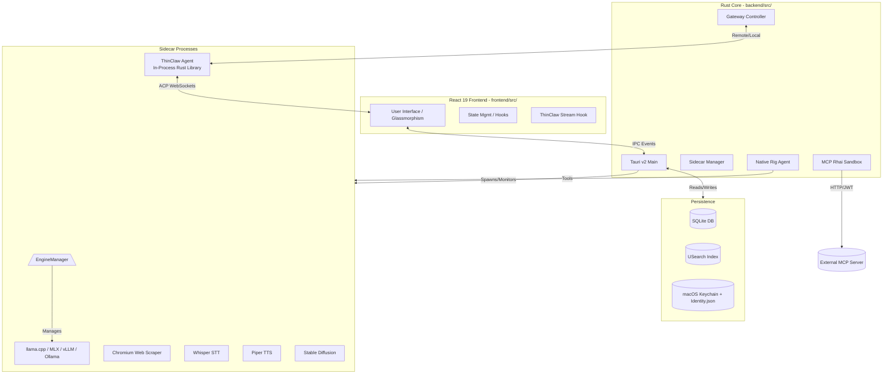

<p align="center">
  
</p>

# ThinClaw Desktop: The ThinClaw Companion App

ThinClaw Desktop is a professional, open-source AI cockpit designed for executive-level workflows, privacy-focused developers, and power users. Built on a high-performance **Tauri v2 / Rust** backend, it features a dual-engine agent architecture: the **ThinClaw** engine for autonomous tasks and a **Native Rust Agent (Rig)** for high-efficiency RAG and search.


---

## Installation & Setup

For a deep dive into environment configuration, prerequisites, and production builds for all engines, see the **[Development Setup Guide](documentation/setup.md)**.

### 1. Requirements
- **macOS / Linux / Windows** (Tauri v2 compatible).
- **Node.js 22.x+** and **npm** (for frontend tooling only).
- **Rust (Stable)**.

### 2. Quick Start
```bash
# 1. Install project dependencies
npm install

# 2. Automated sidecar initialization (Chromium, AI binaries)
npm run setup:all

# 3. Launch in Developer Mode (default engine: llama.cpp)
npm run tauri dev

# Or with a different inference engine:
# npm run tauri dev -- -- --no-default-features --features mlx
# npm run tauri dev -- -- --no-default-features --features ollama
```

### 3. Setup Advice
- **Secrets**: Go to **Settings > Secrets** to add your API keys. ThinClaw Desktop supports **Anthropic**, **OpenAI**, **Google Gemini**, **Groq**, **OpenRouter**, and **Brave Search**. Remember to toggle "Grant Access" for each key to enable them for the agent.
- **Custom Secrets**: You can now add arbitrary custom secrets for specialized agent workflows.
- **Hugging Face**: A **Hugging Face Read Token** is highly recommended. It may be required on first launch to download gated LLMs (like Llama/Gemma) or specialized diffusion models. You can add this in **Settings > Secrets**.
- **Models**: Download models via the in-app **Model Browser** (Settings → Models). Use the **Library** tab for bundled models or the **Discover** tab to search HuggingFace Hub. The Discover tab auto-filters by your active engine (GGUF for llama.cpp/Ollama, MLX safetensors for MLX, AWQ for vLLM).

---

## Vision & Key Capabilities

*   **ThinClaw Agent Architecture**: Full implementation of the ThinClaw streaming protocol, enabling agents to plan, execute tools, and reflect in real-time.
*   **Native Rust Agency (Rig)**: A high-performance agent built on `rig-core` for specialized RAG, deep web search, and visual asset generation.
*   **Autonomous Agency**: The ThinClaw agent ecosystem enables human-in-the-loop agents that can execute shell commands, manage files, and browse the web.
*   **Custom Secrets & Privacy**: Securely manage Anthropic, OpenAI, Gemini, Groq, OpenRouter, and custom API keys with granular "Grant Access" controls.
*   **Multi-Engine Inference**: Supports **llama.cpp** (Metal/CUDA), **MLX** (Apple Silicon), **vLLM** (CUDA), and **Ollama** as swappable local inference backends — selected at compile time via Cargo feature flags. Each engine exposes a unified OpenAI-compatible HTTP API.
*   **HuggingFace Hub Discovery**: Live search of HuggingFace models filtered by the active engine, with GGUF quantization picker, auto-mmproj detection, and streamed downloads.
*   **Standalone Gateway Support**: Connect to local ThinClaw sidecars or remote gateways for distributed agent control.
*   **Imagine Studio**: A dedicated creative suite for image generation with custom bespoke icons, multiple provider support (Local Stable Diffusion, Gemini Imagen 3), and a high-performance integrated **Gallery** with real-time generation progress tracking, horizontal recent-generations strip, and settings restoration support.
*   **MCP Server Integration**: Connect a custom FastAPI MCP server to extend the agent with remote tools — finance APIs, news feeds, domain-specific capabilities — via the Rhai script sandbox.
*   **Voice I/O (TTS & STT)**: Native Text-to-Speech (Piper) and Speech-to-Text (Whisper) sidecars for fully voice-enabled conversations.
*   **Human-in-the-Loop (HITL)**: Advanced security protocols that pause execution for explicit user approval of high-risk shell commands.
*   **Knowledge OS (RAG)**: Enterprise-grade retrieval pipeline with vector search (`usearch`), ONNX reranking, and citation-backed generation.
*   **Web Intelligence**: Deep web scraping via bundled Chromium and real-time news search via Brave Search.
*   **Spotlight Command Bar**: An ultra-fast, system-wide AI overlay for quick queries, neural lookups, and rapid brain access (`Cmd+Shift+K`).

---

## Spotlight: Global AI Access

ThinClaw Desktop includes a premium **Spotlight Bar**—a glassmorphic, system-wide interface that brings the power of your neural engine to any application.

-   **Instant Summon**: Press `Cmd + Shift + K` (macOS) to toggle the Spotlight bar from anywhere.
-   **Neural Status**: A biological status indicator shows your brain state in real-time (Green = Active/Local Brain Online, Gray = Inactive).
-   **Transient Intelligence**: Optimized for "quick-tap" queries. By default, Spotlight sessions are purged upon closing to keep your primary history clean and focused.
-   **Hotkeys**:
    -   `Cmd + L`: Purge the current spotlight session and start fresh.
    -   `Esc`: Hide the bar instantly.
    -   `Enter`: Send prompt.
    -   `Shift + Enter`: Multi-line input.

---

## Technical Architecture

ThinClaw Desktop uses a **Modular Sidecar Architecture**. The Rust core orchestrates several specialized processes to keep the main application lightweight and responsive.



### 1. The ThinClaw Engine
The heart of ThinClaw Desktop's autonomous agency. Built on the **ThinClaw** Rust agent runtime, running **in-process** as a library crate — no Node.js sidecar, no WebSocket bridge:
-   **Session Management**: Each conversation has a dedicated thread with persistent history.
-   **Tool System**: Built-in tools for `exec` (shell), `file_io`, `browser`, `skill` extensions, and **MCP remote tools**.
-   **Streaming Response**: Real-time streaming of tokens, tool inputs, and internal "thinking" via `TauriChannel`.

### 2. The Native Rust Agent (`backend/src/rig_lib`)
A specialized agent engine built using **Rig**. It focuses on performance and reliability for core features:
-   **RAG Integration**: Direct access to the `usearch` vector store for context injection.
-   **Deep Search**: Utilizes `DDGSearchTool` and `ScrapePageTool` for gathering real-time information.
-   **Image Generation**: Native integration with image generation sidecars via `ImageGenTool`, featuring a premium studio interface with real-time progress tracking, style presets, and multi-resolution support (512px to 2K).

---

## ThinClaw Configuration & Lifecycle

ThinClaw is highly configurable through a combination of system files and workspace-level markdown instructions.

### 1. System Infrastructure
These files handle the mechanical aspects of the agent:
- **`identity.json`**: Stores your persistent device ID, auth token, grant flags, and enabled provider/model lists. **Does not contain API keys** — those are stored in the macOS Keychain.
- **Runtime config**: Core ThinClaw runtime config defining the gateway port (default `18789`), model providers, and channel settings. During alpha it is stored in the legacy-compatible `openclaw.json` file.

### 2. Workspace Markdown (The Agent's "Brain")
The agent's personality and rules are defined by markdown files in its workspace. These are injected into the system prompt on session start:
- **`AGENTS.md`**: Core operational manual. Covers memory usage, group chat etiquette, and interaction rules (e.g., avoiding multiple responses to the same input).
- **`SOUL.md`**: Defines your agent's persona, values, and fundamental behavior.
- **`IDENTITY.md`**: High-level identity markers like name, "creature type," and signature emoji.
- **`USER.md`**: Stores what the agent knows about *you* (name, preferences, context).
- **`TOOLS.md`**: Practical conventions for tool usage (camera names, SSH details, shell preferences).

### 3. Lifecycle & Automation
- **`BOOTSTRAP.md`**: A one-time setup ritual performed by the agent in a new workspace.
- **`BOOT.md`**: Startup checklist executed every time the gateway/agent restarts.
- **`HEARTBEAT.md`**: A proactive, periodic checklist for automated tasks (e.g., checking weather, emails, or project status every 30 minutes).

### 4. Management & Visibility
- **Settings Tab**: Manage API keys, model selection, gateway connection modes, and customize your **Spotlight Global Shortcut**.
- **Persona Editing**: Modify `.md` files in the workspace directory to refine the agent's behavior in real-time. For built-in personas, you can find the prompt definitions in `backend/src/personas.rs`.
- **Logs/Transcripts**: Full interaction logs and tool histories are stored as JSONL in the ThinClaw session directory.

### 5. Cloud Inference Providers
ThinClaw Desktop features native integration with the world's most powerful inference engines:
- **Anthropic**: Support for **Claude 4.5 Sonnet** and **Opus** with native Tool Use.
- **OpenAI**: First-class support for **GPT-5.2** (with specialized reasoning) and **GPT-4o** variants.
- **Google Gemini**: Integrated **Gemini 2.0/3.0 Flash/Pro** with support for massive 1M+ token contexts and **Imagen 3** image generation.
- **Groq**: Ultra-fast cloud inference for open models like **Llama 3.3 70B** and **Mixtral**.
- **OpenRouter**: Gateway access to 100+ specialized models via a single API key.
- **Custom Secrets**: Define and grant access to any external API key for use in custom agent tools.

Configure all API keys in **Settings > Secrets**. Toggle "Grant Access" per key to control agent access at runtime.

---

## Project Structure

### Backend (`backend/`)
-   `src/openclaw/`: ThinClaw integration layer.
    -   `commands/`: Tauri IPC command handlers (`gateway.rs`, `keys.rs`, `sessions.rs`, `rpc.rs`, etc.)
    -   `ironclaw_bridge.rs`: ThinClaw agent lifecycle — init, config, Agent construction, shutdown.
    -   `ironclaw_channel.rs`: `TauriChannel` bridging ThinClaw events to Tauri `emit()`.
    -   `ironclaw_secrets.rs`: Keychain ↔ ThinClaw secrets adapter.
    -   `tool_bridge.rs`: MCP tool bridge for ThinClaw agent tool calls.
    -   `sanitizer.rs`: LLM token stripping (ChatML, Llama, Jinja markers).
    -   `ui_types.rs`: `UiEvent` enum — stable UI contract (16+ variants).
-   `src/rig_lib/`: Implementation of the Native Rust Agent and its specialized tools.
    -   `tools/`: `web_search.rs` (29KB), `calculator_tool.rs` (37KB), `scrape_page.rs`, `image_gen_tool.rs`, `rag_tool.rs`.
    -   `orchestrator.rs`: Multi-turn web search and synthesis pipeline.
    -   `unified_provider.rs`: Unified inference provider abstraction.
-   `src/engine/`: Multi-engine inference system (`InferenceEngine` trait, engine implementations for llama.cpp, MLX, vLLM, Ollama).
-   `src/inference/`: InferenceRouter — 5-modality routing (Chat, Embedding, TTS, STT, Diffusion) with local and cloud backends.
-   `src/cloud/`: Cloud storage system — 7 providers (S3, GDrive, iCloud, OneDrive, Dropbox, WebDAV, SFTP) + encryption + sync.
-   `src/sidecar.rs`: The manager for all background binaries (Llama, Chromium, Whisper, TTS, SD).
-   `src/hf_hub.rs`: HuggingFace Hub model discovery, file parsing, and download.
-   `src/templates.rs`: Prompt templates (ChatML, Llama3, Mistral, **Gemma**, **Qwen**) used for model formatting.
-   `src/tts.rs` / `src/stt.rs`: Text-to-Speech (Piper) and Speech-to-Text (Whisper) integration.
-   `src/imagine.rs` / `src/image_gen.rs` / `src/images.rs`: Imagine Studio and image generation pipeline.
-   MCP tools crate: Rust crate providing the MCP sandbox (Rhai scripts, tool discovery, HTTP client).
-   `documentation/openclaw/`: Historical architectural deep-dives from the pre-ThinClaw integration era.

### Frontend (`frontend/src/`)
-   `components/chat/`: The high-performance chat interface.
-   `components/openclaw/`: Visualizations for ThinClaw status and tool execution.
-   `components/imagine/`: Imagine Studio UI (gallery, prompt, style presets).
-   `components/settings/`: Settings pages including `McpTab.tsx`, `SettingsSidebar.tsx`, `SettingsPages.tsx`.
-   `hooks/use-openclaw-stream.ts`: Real-time agent event processing.
-   `hooks/use-chat.ts`: Core chat state management.

---

## Developer Guide: Extending ThinClaw Desktop

### Adding a New Prompt Template
Templates are defined in `backend/src/templates.rs`. To add one:
1.  Define a new `pub const` with your Jinja-like template (ChatML, Llama3, Mistral, Gemma, and Qwen formats already exist).
2.  Add it to the renderer logic in the model manager (`src/model_manager.rs`).

### Adding a New ThinClaw Skill
Skills extend the **ThinClaw** agent:
1.  Create a skill definition with a JSON schema in the ThinClaw skill directory.
2.  Implement the `execute` logic.
3.  The UI will automatically handle rendering based on the tool metadata.

### Adding a Native Rust Tool (Rig)
1.  Implement the `Tool` trait in `backend/src/rig_lib/tools/`.
2.  Register the tool in `RigManager::new` within `backend/src/rig_lib/agent.rs`.
3.  Ensure the tool emits progress events to the UI if long-running.

### Adding an MCP Remote Tool
1.  Expose a new endpoint on your FastAPI MCP server.
2.  Connect the server URL and token in **Settings > MCP Server**.
3.  The Rhai sandbox will auto-discover and expose the tool to the agent.

---

## Security & Safety Philosophy

1.  **Strict Local-First**: Your data and AI transcripts stay on your machine.
2.  **Keychain-Secured Secrets**: API keys are stored in the **macOS Keychain** (AES-256 encrypted at rest), never in plaintext config files. `identity.json` stores only non-sensitive metadata (grant flags, enabled providers).
3.  **Explicit Grant Enforcement**: Saving an API key does **not** automatically expose it to the agent. You must toggle "Grant Access" per key in Settings › Secrets. Only granted keys are injected into the ThinClaw engine as environment variables.
4.  **Environment Variable Gating**: Sensitive credentials (Custom LLM keys, AWS Bedrock) are only injected into the engine process when their corresponding feature is explicitly enabled.
5.  **Human Governance**: Every dangerous command triggers a UI approval request (HITL).
6.  **Sandbox Ready**: Tool execution can be configured to run in Docker containers.

---

## Contributing & Community

ThinClaw Desktop is an evolving platform. We welcome contributions to the RAG pipeline, new agent skills, or UI refinements.

1.  Explore the `documentation/openclaw/` folder for architectural deep-dives.
2.  Check `backend/src/openclaw/commands/` and `backend/src/rig_lib/agent.rs` for backend extension points.

---

## License

Distributed under the **GNU General Public License v3.0** (Strong Copyleft). See `License.md` for more information and attribution requirements.
