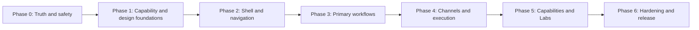

# ThinClaw Desktop Agent Interface Upgrade Roadmap

> **Status:** Implemented in Desktop; release-operator smoke evidence remains pending
> **Verified against code:** 2026-08-01
> **Scope:** ThinClaw Agent Cockpit in `apps/desktop/`
> **Owner:** TBD
> **Companions:** [Runtime boundaries](runtime-boundaries.md), [bridge contract](bridge-contract.md), [remote route matrix](remote-gateway-route-matrix.md), [accessibility contract](accessibility.md), [performance budgets](performance-budgets.md), [broader overhaul plan](OVERHAUL_PLAN.md)

This roadmap converts the current Agent Cockpit from a 32-destination capability
console into a smaller, truthful, task-oriented desktop agent interface. It is
the execution plan for the interface audit completed on 2026-07-31.

The live code is the source of truth. Older roadmap or parity documents can
describe a command or framework as complete when the current page still has a
broken response contract, invented fallback data, an unsupported action, or no
useful local/remote gate. In those cases this roadmap records the work as open.

---

## 0. Execution record — 2026-08-01

The interface migration described here is implemented in the current Desktop
working tree. The primary Cockpit shell now has ten task-oriented destinations,
and every former primary destination resolves through the typed legacy-route
crosswalk. The replacement centers lazily retain existing wired feature panels
where their capability is still valid; they do not invent compatibility data to
make a panel appear populated.

### Delivered in this execution

- Repaired the release-blocking truth defects: Fleet no longer claims targeted
  task dispatch, Repo Projects no longer substitutes production fixtures,
  Channel Config omits stored secrets and reports unavailable secret binding,
  System only exposes supported lifecycle actions, Config is read-only and
  redacts sensitive-looking values, and the unused default-agent control is
  gone.
- Added a typed route registry, route aliases, shared Cockpit status provider,
  capability gates, async-state semantics, keyboard tabs, status/notice/metric
  primitives, and one shared destructive-action confirmation dialog.
- Replaced the 32-item sidebar with Home, Chat, Workspace, Channels,
  Automations, Jobs, Capabilities, Usage, Operations, and Advanced. Profile
  source, freshness, failure, and remediation are visible in the shell.
- Consolidated existing wired content into the new centers; Jobs, Fleet,
  Channels, Config, and System have explicit capability/result handling rather
  than optimistic UI success.
- Classified Desktop-managed sub-agent spawn/list/status operations as
  `LocalOnly` and added matching remote-profile gates. A remote profile cannot
  silently create or manage a child in the embedded runtime; the Cockpit shows
  a Local Core remediation instead.
- Added static semantic-style enforcement, component/contract regression
  coverage, and browser journeys for the consolidated navigation.

### Deliberate gates, not missing data

- Fleet supports live authenticated profile status and broadcast receipts only.
  Targeted task assignment and abort stay unavailable until a selected-profile
  dispatch contract exists.
- Channel setup may display and submit non-secret schema fields. Stored secret
  values are never returned to React, and secret editing remains unavailable
  until an encrypted channel-secret binding is implemented.
- Repo Projects remains quarantined in Advanced instead of being presented as a
  live project-control surface until its end-to-end runtime proof is available.
- Desktop-managed sub-agents are local-runtime operations. Remote profiles do
  not load child sessions or expose an enabled manual spawn control until a
  profile-targeted remote sub-agent contract exists.

Automated verification and the remaining credentialed local/remote smoke work
are recorded in [the release evidence](desktop-agent-interface-upgrade-release-evidence.md).

---

## 1. Executive outcome

The current sidebar exposes 32 top-level pages across Core, Knowledge,
Channels, Automation, Tooling, and System. The runtime beneath those pages is
broadly capable, but the interface gives equal prominence to:

- primary tasks such as chat, automations, jobs, channels, and memory;
- narrow diagnostic views that should be tabs or sections;
- advanced and experimental systems that need explicit capability gates;
- duplicate views over the same state;
- controls whose frontend and backend contracts disagree;
- production fixtures or synthesized fallback state that can look live.

The upgrade will:

1. reduce the main navigation to no more than ten task-oriented destinations;
2. preserve real capabilities while merging duplicate pages;
3. make local, remote, unavailable, degraded, and stale states explicit;
4. eliminate invented data, false success messages, and clickable unsupported actions;
5. standardize the Cockpit on the existing shared Desktop design tokens and UI primitives;
6. retain the Direct Workbench and Agent Cockpit as separate product systems;
7. add contract, component, accessibility, visual, and end-to-end gates that test real wire shapes.

### Current disposition

| Disposition | Count | Meaning |
|---|---:|---|
| Stay as a first-class capability | 5 | Keep the page or its primary destination, with normal refinement. |
| Overhaul | 18 | The underlying capability is valuable, but its current contract, placement, or interaction model is not acceptable. |
| Remove as a standalone page | 9 | Merge the capability into another destination. Backend deletion is not implied. |

### Release-blocking truth defects

These are correctness defects, not visual polish:

1. Fleet reports that a task was spawned on the selected remote agent while the command runs the embedded local runtime.
2. Repo Projects substitutes fabricated projects, workers, pull requests, checks, and events when real data is empty.
3. Channel Config does not load current values, renders secret fields the backend rejects, and treats `ok: false` as success.
4. System expects a configuration envelope the backend does not return and announces update/rebuild/restart success for a backend no-op.
5. Config Editor exposes quick settings whose runtime consumers read environment variables or different structured configuration.
6. The default-agent star persists a setting for which no runtime reader is present.

No later visual milestone can ship while these defects remain reachable without
an honest unavailable or preview state.

---

## 2. Locked product decisions

| Decision | Rule |
|---|---|
| Product boundary | Keep Direct AI Workbench and ThinClaw Agent Cockpit distinct, as required by `runtime-boundaries.md`. Do not move autonomous authority into Direct chat. |
| Navigation model | Organize by user task and operating responsibility, not by one backend command group per page. |
| Capability truth | A registered command is not sufficient evidence that a feature is usable. UI availability requires a valid route, runtime prerequisites, permissions, and a response contract the page actually consumes. |
| Local and remote | Use one shared visual structure, but show mode, source, limitations, and remediation wherever behavior differs. |
| Advanced features | Fleet, autonomy, learning, experiments, lifecycle hooks, routing, raw config, and event inspection are hidden behind an Advanced/Labs entry and capability gates. |
| Demo data | Never substitute demonstration records into production state. Examples belong in documentation, onboarding previews, Storybook-like fixtures, or explicitly labeled demos. |
| Errors | Never turn a failed fetch into plausible status. Preserve last-known data only when visibly marked stale with a timestamp. |
| Success | A toast may summarize a result, but the backend result must prove that the requested action was applied. Persisted, forwarded, restarted, prepared, and installed are different outcomes. |
| Visual direction | Evolve the existing semantic-token, neutral, compact desktop language. Do not introduce a separate “agent theme.” |
| Pre-1.0 cleanup | Route and component breaking changes are allowed when aliases, migrations, generated bindings, tests, and documentation land together. |

### Non-goals

- Collapsing Workbench and Agent chat into one runtime.
- Rewriting ThinClaw core capabilities solely to fit a page layout.
- Adding new channel adapters, learning algorithms, or experiment backends unless required to make an advertised existing flow truthful.
- Making every expert control permanently visible.
- Creating a second theme engine, component library, settings store, event bus, or command client.
- Treating remote parity as “return some JSON.” Remote behavior must be useful or explicitly gated.

---

## 3. Product goals and measurable acceptance

### G1 — Honest capability surface

- Zero production fixtures used as fallback operational data.
- Zero unconditional success copy for no-op, prepared-only, or partially applied actions.
- Every navigation item and mutating control evaluates a typed capability state.
- Every unavailable state includes a reason and, where possible, one concrete remediation.
- Stale data is labeled with its source and last successful refresh time.

### G2 — Task-first information architecture

- No more than ten primary Agent destinations.
- Session search is reachable from the session/chat workflow.
- Channel status, configuration, OAuth, and pairing are one Channel Center.
- Routine history/audit is part of Automations.
- Cache telemetry is part of Usage or Diagnostics.
- Gateway status, logs, Doctor, Remote Access, and Rollback are grouped under Operations.

### G3 — Fast operational comprehension

A user must be able to answer these questions without opening multiple pages:

- Which agent/profile am I operating?
- Is it local or remote, connected or degraded?
- What can this profile do here?
- What is running, blocked, waiting for approval, or failed?
- What changed after my action?
- Where can I remediate the problem safely?

### G4 — Current Desktop visual language

- All rebuilt pages use shared semantic surface/content tokens.
- All common actions use shared `Button` variants and control heights.
- All asynchronous states use shared or successor loading/empty/error/unavailable primitives.
- All five application palettes, light/dark/system mode, and compact/default density remain supported.
- Raw `white/*`, `black/*`, zinc, cyan, or indigo styling is not used for ordinary structure.

### G5 — Accessible and resilient

- All primary workflows are keyboard-complete.
- Focus order remains stable when panels appear, refresh, or become gated.
- Status never depends on color alone.
- Reduced motion and forced-colors behavior pass the Desktop accessibility contract.
- The interface remains usable through reconnects, partial data, long-running actions, and explicit cancellation.

### G6 — Contract-tested

- Component tests use serialized fixtures generated from or validated against Rust types.
- Local and remote tests cover supported and unavailable paths separately.
- Every destructive action has a confirmation test.
- Every page has loading, empty, error, unavailable, partial, and success coverage where applicable.
- The top task journeys pass browser E2E and deterministic Tauri IPC runs.

---

## 4. Target information architecture

The top-level Agent navigation becomes:

| Destination | Purpose | Current pages absorbed |
|---|---|---|
| **Home** | Runtime health, active work, blockers, approvals, channel summary, spend summary, and actionable remediation. | Dashboard, trustworthy parts of Presence, high-level Doctor/System status |
| **Chat** | Sessions, conversation, approvals, credentials, tool activity, subagents, memory context, and search. | Live Chat, Session Search, chat-related compaction settings |
| **Workspace & Memory** | Agent workspace documents, daily memory, semantic search, and explicitly local host files. | The Brain, Temporal Memory |
| **Channels** | Channel inventory, health, configuration, secrets/OAuth, pairing, and stream behavior. | Channels, Channel Status, Channel Config, DM Pairing |
| **Automations** | Routine creation, schedules, event triggers, run history, audit, enable/disable, and manual run. | Automations, Routine Audit |
| **Jobs** | Active and historical job execution with capability-aware detail/actions/files/prompts. | Jobs |
| **Capabilities** | Skills, extensions/MCP, tool access, and advanced lifecycle hooks. | Skills, Plugins, Tool Policies, Hooks |
| **Usage** | Cost, limits/alerts, model/agent breakdowns, exports, and cache efficiency. | Cost Dashboard, Cache Stats |
| **Operations & Safety** | Gateway lifecycle, logs, diagnostics, remote access, checkpoints/rollback, and operational remediation. | System, Doctor, Remote Access, Rollback, operational Presence |
| **Advanced / Labs** | Explicitly experimental or specialist surfaces, shown only when relevant. | Fleet, Routing, Learning Review, Trajectory, Autonomy, Experiments, Event Inspector, raw Config Editor, Repo Projects when real |

Advanced/Labs can use an internal list or tab rail, but its children must not
reappear as permanent primary sidebar items.

### Complete 32-page migration crosswalk

| Current destination | Current disposition | Target location |
|---|---|---|
| Dashboard | Overhaul | Home |
| Live Chat | Stay | Chat |
| Fleet Command | Overhaul | Advanced / Labs → Fleet |
| The Brain | Overhaul | Workspace & Memory → Agent Workspace |
| Temporal Memory | Remove standalone | Workspace & Memory → Daily Memory |
| Learning Review | Overhaul | Advanced / Labs → Evaluation |
| Trajectory | Overhaul | Advanced / Labs → Evaluation → Datasets |
| Rollback | Stay | Operations & Safety → Checkpoints |
| Session Search | Remove standalone | Chat session search |
| Cost Dashboard | Stay | Usage → Cost |
| Cache Stats | Remove standalone | Usage → Cache |
| Channels | Overhaul | Channels → Overview |
| Channel Status | Remove standalone | Channels → per-channel health |
| Channel Config | Remove current page | Channels → per-channel Setup |
| Presence | Remove standalone | Home and Operations summaries |
| DM Pairing | Remove standalone | Channels → per-channel Security |
| Routing | Overhaul | Advanced / Labs → Routing |
| Automations | Stay | Automations |
| Jobs | Overhaul | Jobs |
| Repo Projects | Remove current surface | Advanced / Labs only after live readiness |
| Autonomy | Overhaul | Advanced / Labs → Autonomy |
| Experiments | Overhaul | Advanced / Labs → Experiments |
| Routine Audit | Remove standalone | Automations → History |
| Hooks | Overhaul | Capabilities → Hooks (Advanced) |
| Skills | Overhaul | Capabilities → Skills |
| Plugins | Overhaul | Capabilities → Extensions & MCP |
| Tool Policies | Overhaul | Capabilities → Tool Access |
| Config Editor | Overhaul | Advanced / Labs → Developer Settings; compaction moves to Chat |
| Remote Access | Stay | Operations & Safety → Remote Access |
| Event Inspector | Overhaul | Advanced / Labs → Developer Events |
| Doctor | Overhaul | Operations & Safety → Diagnostics |
| System | Overhaul | Operations & Safety → Gateway and Logs |

### Sidebar chrome

- Keep the local/remote agent profile switcher.
- Show connection state, runtime mode, and capability freshness in the switcher.
- Remove “Set default” until default-profile behavior is implemented end to end.
- Keep session creation and selection adjacent to Chat; move search into the same area.
- Keep Gateway Settings and Manage Agents as global destinations.
- Show manual refresh only after error/staleness or in an overflow menu.
- Preserve collapsed-sidebar keyboard behavior and programmatic names.
- Source all navigation, command-palette entries, route aliases, and capability rules from one typed route registry.

---

## 5. Interaction and visual design contract

### 5.1 Visual personality to preserve

The current Desktop language is a quiet, compact control surface:

- Outfit typography;
- neutral theme-derived canvas and panels;
- soft rounded controls and panels;
- Lucide line icons;
- restrained borders and shadows;
- small uppercase tracking for occasional section eyebrows;
- semantic green/amber/red status accents;
- optional compact density;
- light, dark, system, Zinc, Indigo, Emerald, Rose, and Amber palette support.

The upgrade should make that language more consistent, not replace it with a
heavier dashboard aesthetic.

### 5.2 Token rules

Use the existing semantic aliases:

| Purpose | Required token/class |
|---|---|
| Page canvas | `bg-surface-canvas text-content-primary` |
| Standard panel | `bg-surface-panel border-surface-outline` or `Surface elevation="panel"` |
| Raised popover/drawer/dialog | `bg-surface-elevated` or `Surface elevation="elevated"` |
| Quiet nested area | `bg-surface-subtle` or `Surface elevation="subtle"` |
| Primary text | `text-content-primary` / `text-foreground` |
| Secondary text | `text-content-muted` / `text-muted-foreground` |
| Focus | global `--surface-focus` focus-visible outline |
| Primary action | shared `Button variant="primary"` |
| Secondary action | shared `Button variant="secondary"` |
| Quiet action | shared `Button variant="ghost"` |
| Destructive action | shared `Button variant="danger"` |

Do not use `bg-white/3`, `bg-white/5`, `border-white/5`, hardcoded zinc, or
black translucent surfaces for ordinary page structure. Backdrop blur may be
used for actual overlays or transient floating tools, not every card.

Status colors remain independent because they communicate meaning:

- emerald: healthy, connected, completed;
- amber: waiting, degraded, stale, partial, or restart required;
- red/destructive: failed, denied, unsafe, or destructive action;
- primary: selected or actively operating;
- muted: disabled, absent, stopped, or not configured.

Every status color must be accompanied by visible text or an accessible label.

### 5.3 Geometry and density

- Controls use `--radius-control`, `--control-height`, and `--control-height-compact`.
- Panels use `--radius-panel`; dialogs and side sheets use `--radius-dialog`.
- Default content padding is `p-6`; compact/list surfaces use `p-4`; dense table rows use `px-3 py-2`.
- Maintain a stable 8/12/16/24/32 spacing rhythm.
- Use default and compact density tokens instead of page-specific compressed variants.
- Keep primary page content readable at approximately 720–1440 px; allow logs, tables, graphs, and split inspectors to use the full available width.
- At narrow desktop widths, inspector panels become sheets or stacked sections rather than shrinking core content below usability.

### 5.4 Typography

- Page title: `text-xl font-semibold` or the established equivalent.
- Page description: `text-sm text-muted-foreground`.
- Section title: `text-sm font-semibold`.
- Optional eyebrow: `text-[10px] font-bold uppercase tracking-widest`; do not use uppercase for sentences, warnings, or most buttons.
- Body: `text-sm`; helper/meta: `text-xs`.
- Monospace is reserved for identifiers, commands, cron expressions, file paths, hashes, logs, and JSON.
- Avoid militarized or theatrical labels. Use “Stop gateway,” not “Emergency Shutdown”; “Start agent,” not “Initialize Engine,” unless initialization is a distinct operation.

### 5.5 Required shared components

Extend `frontend/src/components/ui/` instead of hand-building each page:

| Component | Responsibility |
|---|---|
| `AgentPageShell` | Page title, description, mode/capability badge, actions, scroll behavior, and consistent content width. |
| `PageHeader` | Heading hierarchy, breadcrumb/back behavior, primary action, and responsive action overflow. |
| `Button` | Existing variants plus documented loading/icon behavior. |
| `Surface` | Existing panel/elevated/subtle surfaces. |
| `AsyncState` | Existing loading/empty/error behavior, extended with unavailable, partial, and stale states. |
| `CapabilityGate` | Renders content, disabled action, or remediation state from typed capability data. |
| `StatusBadge` | One normalized status vocabulary and icon/text/color mapping. |
| `MetricCard` | Value, label, trend/context, data source, and optional action without decorative fake metrics. |
| `Tabs` / `SegmentedControl` | Keyboard-complete sub-navigation with stable URLs/state. |
| `Field`, `SecretField`, `SelectField`, `SwitchField` | Consistent labels, descriptions, validation, and disabled/remediation behavior. |
| `ConfirmDialog` | Focus-trapped confirmation with consequence, target identity, and optional exact-text confirmation. |
| `Notice` | Persistent info, warning, partial-success, and error feedback. |
| `DataTable` / `VirtualList` | Sort/filter, keyboard row actions, empty/loading state, and large-data performance. |
| `InspectorDrawer` | Detail views for channels, jobs, capabilities, and events without navigation loss. |
| `ActivityTimeline` | Normalized timestamp, source, status, detail, and expandable raw context. |

Do not create another page-local `StatusBadge`, `MetricCard`, or confirmation
pattern once the shared version exists.

### 5.6 Page composition

Every destination follows this order:

1. Page header: task name, concise purpose, runtime/profile badge, primary action.
2. Critical notice: disconnected, degraded, unavailable, stale, or action required.
3. Primary work area: list, chat, setup, job details, or operational control.
4. Secondary evidence: recent activity, metrics, logs, or metadata.
5. Destructive/advanced controls: separated and clearly labeled.

Do not lead with decorative metric cards when there is a blocked action or
required setup.

### 5.7 Asynchronous and action states

Every data surface explicitly supports:

- initial loading;
- empty but available;
- unavailable in current runtime mode;
- permission or setup required;
- partial response;
- stale last-known data;
- retryable error;
- non-retryable error;
- refreshing while retaining data;
- mutation in progress;
- applied success;
- partial success or restart required.

Rules:

- Keep last-known data during refresh, but mark it stale after the freshness budget.
- Never replace failure with synthesized entities.
- Disable duplicate submissions and expose cancellation when the backend supports it.
- Preserve user-entered form data after recoverable failure.
- Persistent outcomes appear inline; toasts are supplementary.
- Use action-specific verbs: “Saved,” “Applied,” “Forwarded,” “Restart required,” “Prepared,” and “Installed” are not interchangeable.

### 5.8 Destructive and security-sensitive actions

- Stop gateway, restore checkpoint, clear cost history, delete session, remove skill/extension, revoke pairing, and disable autonomy require a shared confirmation pattern.
- Confirmation text names the target and the consequence.
- Exact-text confirmation is reserved for broad or difficult-to-recover operations.
- Secrets never round-trip to the renderer after storage.
- Secret fields show configured/unconfigured/invalid status, not the stored value.
- Raw event, log, and tool payloads are treated as sensitive and collapsed by default.
- Copy/export actions warn or redact when content can contain credentials or personal data.

### 5.9 Accessibility, motion, and localization

- Follow `accessibility.md` as a release contract.
- Use semantic headings and landmarks; one `h1` per destination.
- Tabs use `tablist`/`tab` semantics and arrow-key navigation.
- Drawers/dialogs trap focus and restore it to the invoker.
- Icon-only buttons have names and tooltips; tooltips do not contain required information.
- Live updates use bounded polite regions; failures and denied actions use alerts.
- Do not announce every streaming token or high-volume event.
- Honor reduced motion; avoid layout animation for continuously updating metrics.
- All user-facing copy enters the existing i18n path as pages are rebuilt.
- Truncation has a discoverable full value for identifiers and paths.

### 5.10 Performance

- Reuse one status/capability polling source instead of page-local intervals.
- Pause nonessential polling for hidden routes and background windows.
- Coalesce stream updates through the existing event buffer.
- Virtualize long session, event, job, audit, skill, and extension lists.
- Lazy-load Advanced/Labs panels.
- Preserve the current 500 KiB JavaScript chunk budget.
- Avoid serial request waterfalls when independent summaries can load concurrently.
- Cancel stale detail requests when selection changes.

---

## 6. Capability and frontend architecture

### 6.1 Capability snapshot

Add one typed capability snapshot derived from runtime mode, route behavior,
actual subsystem availability, OS permissions, configuration, and live remote
gateway support.

Illustrative shape:

```ts
type CapabilityState = {
  available: boolean;
  mode: "local" | "remote" | "both";
  state: "ready" | "setup_required" | "permission_required" | "degraded" | "unavailable";
  reason?: string;
  remediation?: { label: string; destination?: string; command?: string };
  source: "embedded" | "gateway";
  checkedAt: string;
};

type AgentCapabilitySnapshot = {
  profileId: string;
  runtimeMode: "local" | "remote";
  connection: "connected" | "reconnecting" | "disconnected" | "stopped";
  capabilities: Record<AgentCapabilityId, CapabilityState>;
};
```

The snapshot must not infer support from command registration alone. Examples:

- Fleet targeted dispatch is unavailable until the selected profile is actually used as a transport target.
- Job files are unavailable for local direct jobs even though a frontend wrapper exists.
- Remote Access is unavailable for a remote profile because it controls the local host.
- Channel secret configuration is unavailable until encrypted secret binding is supported.

### 6.2 Typed route registry

Replace the separate page union, hardcoded sidebar groups, route switch, and
command-palette entries with one registry:

```ts
type AgentRouteDefinition = {
  id: AgentRouteId;
  labelKey: string;
  descriptionKey: string;
  icon: LucideIcon;
  section: "primary" | "operations" | "advanced";
  capability?: AgentCapabilityId;
  aliases?: LegacyAgentRouteId[];
  lazyComponent: LazyExoticComponent<ComponentType>;
};
```

The registry drives:

- expanded and collapsed sidebar;
- command palette;
- keyboard navigation;
- route rendering;
- legacy aliases;
- breadcrumbs;
- capability visibility;
- analytics/telemetry names;
- test enumeration.

### 6.3 Shared Cockpit provider

Introduce or consolidate a single `AgentCockpitProvider` that owns:

- selected profile and runtime mode;
- connection and reconnect state;
- capability snapshot;
- session summary/list freshness;
- normalized high-level presence;
- shared event subscription;
- action outcome rendering;
- query invalidation after mutations.

Pages should consume focused selectors/hooks so high-volume chat events do not
rerender the entire Cockpit.

### 6.4 Action result contract

Mutating commands that can partially apply use a common typed outcome:

```rust
struct ActionOutcome {
    ok: bool,
    state: ActionState, // Applied | Persisted | Prepared | RestartRequired | Rejected
    message: String,
    changed: bool,
    remediation: Option<Remediation>,
}
```

The exact shared type may differ, but the semantic distinction is mandatory.
Frontend success handling must inspect the domain result, not only the Tauri
transport envelope.

### 6.5 Data-source rules

- Generated bindings remain the command/type source of truth.
- No production component imports fixture data as an operational fallback.
- A preview/demo requires an explicit prop, build flag, or route and a visible “Demo” label.
- Local and remote adapters normalize into a shared DTO only when the semantics are equivalent.
- Missing remote fields remain unknown, not zero.
- Persisted sessions are not labeled live without active-run or connection evidence.
- Uptime is measured from actual runtime start, not first dashboard query.

---

## 7. Execution roadmap

Phases are dependency-gated. Parallel work is allowed within a phase after its
foundational contracts land. A phase is complete only when its exit gate passes.

### Task tracking protocol

Every `DAIU-*` item is an independently reviewable deliverable. When execution
starts, its issue or project record must include:

- status: Planned, Ready, In progress, Blocked, In review, or Done;
- accountable owner and reviewers;
- dependency IDs and affected local/remote modes;
- implementation pull request and generated-binding changes;
- test and visual/accessibility evidence;
- documentation updated in the same change;
- rollout or migration note when existing routes, settings, or behavior change.

“Done” means the item’s stated acceptance criteria and applicable phase gate
pass. A merged command, rendered component, or green mock-only test is not by
itself completion evidence.



### Phase 0 — Truth and safety

**Goal:** remove or gate every interface behavior that can misrepresent where an
action ran, whether it succeeded, or whether displayed data is real.

| ID | Task | Execution details | Acceptance |
|---|---|---|---|
| DAIU-001 | Fleet dispatch honesty | Disable selected-agent spawn in the current UI, or add a real profile-targeted remote dispatch command. Do not reuse local `thinclaw_spawn_session` as proof of remote dispatch. Rename synthesized “Ready”/progress fields or omit them. | A remote profile can never receive a success toast unless a request reached that profile and returned a target receipt. |
| DAIU-002 | Remove Repo Projects production fixtures | Initialize with empty state. Remove `SHELL_PROJECTS`/`SHELL_EVENTS` fallback from production hooks. Keep fixtures only in tests or explicit demo stories. Add setup-required and unavailable states. | Empty backend data renders an honest empty/setup view; no fabricated PR, worker, check, event, or timestamp is visible. |
| DAIU-003 | Repair Channel Config contract | Read current non-secret values; represent secret status without returning secrets; route secret submission through encrypted storage/grants; inspect `ok`, `persisted`, `forwarded`, and restart requirements. Until complete, hide unsupported fields and link to supported setup. | Existing values load, secret values never echo, unsupported fields cannot submit, and partial apply never renders as full success. |
| DAIU-004 | Repair System page contract | Remove the incompatible Workbench/Agent config tabs from System. Keep gateway lifecycle and logs. Delete the embedded no-op updater control or route to the real global updater. Replace “Emergency Shutdown” with “Stop gateway” and add confirmation when active work exists. | System shows no controls backed by an incompatible or no-op command; start/stop and logs remain functional. |
| DAIU-005 | Audit Config Editor consumers | Classify each quick setting as live DB setting, environment-only, structured config, restart-required, or unused. Remove unsupported quick controls. Link legitimate provider/model settings to global Settings. Move compaction to Chat. | Every remaining control has a verified reader, type, validation rule, apply/restart behavior, and test. |
| DAIU-006 | Eliminate invented fallback status | Remove synthetic channel entities and similar plausible fallback data. Introduce explicit error/stale states with last-success timestamps. | A failed status fetch cannot create an enabled channel or healthy subsystem. |
| DAIU-007 | Resolve default-agent behavior | Either implement read/apply/default ordering across profile DTOs and startup selection, or remove the star and command from the interface. | The interface and runtime agree on the selected default after restart, or no default control is shown. |
| DAIU-008 | Gate unsupported Job actions | Bind Restart, Prompt, Files, Cancel, and future actions to returned capability flags and job state. | Unsupported controls are absent or disabled with remediation; clicking cannot be the first discovery of unavailability. |
| DAIU-009 | Add regression contracts for truth defects | Add Rust/TypeScript fixtures and component tests for Fleet target receipts, channel partial success, System config shape, updater no-op handling, Repo empty state, and job capability gates. | Each Phase 0 defect has a failing-before/passing-after automated test using real wire shapes. |

**Exit gate:** all six release-blocking truth defects are removed, repaired, or
unambiguously gated. No production page substitutes fixture entities after a
failed or empty response.

### Phase 1 — Capability and design foundations

**Goal:** establish shared contracts and primitives before rebuilding pages.

| ID | Task | Execution details | Acceptance |
|---|---|---|---|
| DAIU-100 | Capability snapshot backend | Add a typed aggregate command or generated equivalent for runtime, route, subsystem, permission, and configuration availability. Include source and checked time. | Local stopped/running and remote connected/disconnected fixtures produce deterministic snapshots. |
| DAIU-101 | Capability provider and gate | Add `AgentCockpitProvider`, `useAgentCapability`, and `CapabilityGate`. Preserve actionable `BridgeError` remediation. | Navigation and actions consume the same capability state; no page adds an ad hoc gateway boolean. |
| DAIU-102 | Typed Agent route registry | Create one registry for routes, labels, icons, capabilities, lazy components, aliases, and sections. | Sidebar, command palette, route renderer, and tests enumerate the same registry. |
| DAIU-103 | Shared action outcome | Normalize applied, persisted, prepared, restart-required, rejected, and unchanged results. Migrate Channel Config, Extensions, System actions, skills, and settings first. | Toast/inline copy is derived from the domain outcome; transport success alone cannot show applied success. |
| DAIU-104 | Status vocabulary | Define canonical runtime, job, channel, routine, skill, extension, and connection states plus unknown/stale. Map backend-specific strings at adapters. | One shared `StatusBadge` covers known states and visibly handles unknown values. |
| DAIU-105 | Shared status freshness | Consolidate page polling, reconnect state, last-success timestamps, invalidation, and retry. | Dashboard/Presence/System/Channel pages no longer run competing status loops. |
| DAIU-106 | Event sensitivity model | Classify event/log/tool fields for default display, collapse, redaction, copy, and export. | Event Inspector, logs, and tool history share the same safe rendering rules. |
| DAIU-110 | Page and state primitives | Build `AgentPageShell`, `PageHeader`, extended `AsyncState`, `Notice`, `StatusBadge`, `MetricCard`, and `CapabilityGate`. | New pages contain no hand-built equivalents and pass keyboard/ARIA tests. |
| DAIU-111 | Forms and confirmation primitives | Build typed fields, `SecretField`, field errors, `ConfirmDialog`, loading buttons, and restart-required notice. | Channel, settings, pairing, and destructive flows use the shared primitives. |
| DAIU-112 | Lists, tables, inspectors, and tabs | Build accessible tabs, virtual list/table patterns, inspector drawer, activity timeline, and responsive panel behavior. | Job, channel, capability, usage, and event views can migrate without page-local navigation patterns. |
| DAIU-113 | Semantic style normalization | Add a lint/search guard for new hardcoded structural white/black/zinc colors in Agent components. Migrate shared primitives first. | Rebuilt pages render correctly across every palette, color mode, and density. |
| DAIU-114 | Copy and icon glossary | Define route names, action verbs, status terms, local/remote language, remediation grammar, and canonical Lucide icons. | No duplicate names such as Engine/Gateway/Node for the same object within one workflow. |

**Exit gate:** a capability-gated sample page renders all async states in local
and remote fixtures across supported themes and density modes.

### Phase 2 — Shell and navigation

**Goal:** establish the ten-destination shell and preserve user continuity while
old pages are migrated.

| ID | Task | Execution details | Acceptance |
|---|---|---|---|
| DAIU-200 | New sidebar hierarchy | Implement Home, Chat, Workspace & Memory, Channels, Automations, Jobs, Capabilities, Usage, Operations & Safety, and Advanced/Labs. | Primary sidebar contains no more than ten destinations and remains fully usable collapsed. |
| DAIU-201 | Legacy route aliases | Map all 32 existing route IDs to target destinations/tabs. Preserve selected session and Chat’s always-mounted run state. | Old in-app links land on the correct new section without blank states. |
| DAIU-202 | Profile switcher overhaul | Show local/remote, connected/reconnecting/stopped, selected profile, and freshness. Surface switching errors inline. Resolve/remove default star. | A user always knows which profile an action will target. |
| DAIU-203 | Session navigation | Put create, select, search, delete, active-run, and unread/approval state into the Chat navigation context. Replace hidden force-reset/delete behavior with an explicit recovery flow. | Search and recovery no longer require separate pages or surprise destructive actions. |
| DAIU-204 | Command palette parity | Add every primary destination and safe common action from the route registry. Hide/gate unsupported commands. | Sidebar and command palette cannot disagree on capability availability. |
| DAIU-205 | Advanced/Labs boundary | Add an Advanced/Labs landing page explaining maturity, mode, host requirements, risk, and opt-in state. Lazy-load children. | Experimental controls do not appear as ordinary primary navigation. |
| DAIU-206 | Navigation accessibility | Preserve roving focus, Home/End/arrows, Mod shortcuts, focus expansion, labels, current-page state, and reduced motion. | Accessibility contract and shell browser tests pass in expanded and collapsed modes. |

**Exit gate:** all existing pages are reachable through aliases, primary
navigation has ten or fewer entries, and unsupported Labs panels cannot be
entered without an explanatory gate.

### Phase 3 — Primary workflows

#### DAIU-300 — Home

**Goal:** replace Dashboard and Presence with one trustworthy operational
summary.

Tasks:

- Show selected profile, local/remote source, connection, engine/gateway state, and freshness.
- Show active runs, jobs, automations, pending approvals, credential prompts, and blockers.
- Show compact channel health and cost/limit summaries linked to their owning pages.
- Show remediation before decorative metrics.
- Remove the decorative Auth Token Hash.
- Derive uptime from runtime lifecycle, not first query.
- Label persisted sessions separately from active live runs.
- Never infer channel availability from a fallback list.

Acceptance:

- Every value names or exposes its source and handles unknown/remote-missing data.
- Stopped, connecting, degraded, healthy, remote-partial, and stale fixtures are covered.
- No Home card duplicates a full management UI.

#### DAIU-310 — Chat

**Goal:** preserve the strongest current capability while reducing control
density.

Tasks:

- Keep chat always mounted so active runs, events, and drafts survive navigation.
- Keep streaming, abort, approvals, credential prompts, tool history, subagents, thinking mode, export, undo/redo, personality, memory, and console capabilities.
- Group session-level actions in one overflow menu.
- Move session search into the session rail.
- Move compaction/context controls into a contextual “Context” panel.
- Keep Memory and Console as explicit inspector tabs rather than floating pills.
- Provide clear running, awaiting approval, compacting, reconnecting, aborted, and failed states.
- Ensure secure prompt values never enter logs, exports, or persisted draft state.
- Virtualize long histories and keep per-run event routing deterministic.

Acceptance:

- An active run survives navigation among all primary destinations.
- Keyboard users can send, stop, approve/deny, answer credentials, inspect tools, switch session, and return focus.
- Session delete and forced recovery have explicit consequences and confirmations.

#### DAIU-320 — Workspace & Memory

**Goal:** unify agent documents, daily memory, semantic search, and local host
files without blurring authority.

Tasks:

- Tabs: Agent Workspace, Daily Memory, Search, and Local Host Files.
- Hide or gate Local Host Files for remote profiles.
- Label DB-backed agent files versus host filesystem paths.
- Support list/read/edit/save/delete with dirty-state protection.
- Return a typed not-found state instead of a successful string such as “File X not found.”
- Integrate semantic search result source, score, date, and navigation.
- Retain canonical memory documents and bootstrap identity files.
- Make automatic-memory claims conditional on the feature actually being configured.

Acceptance:

- Remote profiles cannot appear to browse the local host.
- Unsaved changes are protected during selection/profile changes.
- Not-found, conflict, permission, empty, and remote-unavailable states are tested.

#### DAIU-330 — Usage

**Goal:** keep cost controls first class and make cache telemetry supporting
evidence.

Tasks:

- Tabs: Cost and Cache.
- Show daily/monthly/selected-range cost with explicit limit/alert semantics.
- Retain model and agent breakdowns, export, and reset.
- Put reset behind shared destructive confirmation.
- Show cache hit/miss, size, savings or latency context only when the backend can substantiate it.
- Mark local/remote source and freshness.
- Use theme chart tokens and accessible labels/tooltips.

Acceptance:

- Every total states its time range, currency/unit, and source.
- Reset results update the current view and never imply a provider billing reset.
- Charts remain legible without color and in every theme.

#### DAIU-340 — Operations & Safety

**Goal:** consolidate real gateway lifecycle, logs, diagnostics, remote access,
and rollback.

Tasks:

- Tabs or sections: Overview, Gateway, Logs, Diagnostics, Remote Access, Checkpoints.
- Gateway: start/stop/restart only when real; active-work warning and confirmation.
- Logs: history plus live stream, filter/search, pause without data-loss ambiguity, copy/export with sensitivity handling.
- Diagnostics: expand Doctor to providers/models, DB, workspace, channels, routines, skills/extensions, OS permissions, network, remote authentication, and update state where applicable.
- Each failed diagnostic has a remediation action or documentation link.
- Remote Access retains bounded Tailscale Serve/Funnel commands and public-exposure confirmation; show local-only capability.
- Checkpoints retain list/diff/restore and show affected workspace, scope, timestamp, and recovery consequence.
- Remove the embedded no-op updater; link to the real global updater when available.

Acceptance:

- No configuration editor remains in Operations.
- Stop/restart/restore actions identify the exact profile/workspace and require appropriate confirmation.
- Remote Diagnostics does more than serialize one opaque gateway status object.

**Phase 3 exit gate:** Home, Chat, Workspace & Memory, Usage, and Operations
replace their legacy primary pages, with aliases and complete state coverage.

### Phase 4 — Channels and execution

#### DAIU-400 — Channel Center

**Goal:** replace four separate channel pages with one end-to-end setup and
operations workflow.

Tasks:

- Overview cards show configured, enabled, runtime health, transport, last activity, and setup action.
- Channel inspector tabs: Health, Setup, Security/Pairing, Stream Behavior, Activity.
- Remove synthesized Slack/Telegram/Discord/Webhook fallback entities.
- Replace WhatsApp/web-login copy with actual Cloud API or supported-adapter behavior.
- Normalize rich backend lifecycle states rather than exact-string styling.
- Preserve unknown remote counters as unknown, not zero.
- Move Gmail OAuth and Apple Mail setup into the generic channel framework where possible.
- Pairing codes and approvals live in the selected channel Security tab.
- Provide restart/apply instructions per adapter.

Acceptance:

- A new user can discover whether a channel is supported, configure it, complete OAuth/pairing, start it, and confirm health without changing pages.
- A failed list/status request produces no invented channel.

#### DAIU-401 — Channel schema and secret contract

Tasks:

- Upgrade the current schema to distinguish text, number, boolean, select, secret, OAuth, instructions, and read-only status.
- Add a current-values response for non-secrets and configured-state metadata for secrets.
- Submit secrets separately through the encrypted store and grant path.
- Validate required values before persistence.
- Return an `ActionOutcome` distinguishing persisted, live-forwarded, restart-required, and rejected.
- Test native, WASM, local, remote, unregistered, and secret-bearing adapters.
- Reconcile the “implemented” status in `design/TDO-120-channel-config-framework.md` with the production-ready contract.

Acceptance:

- No password/secret field is rendered unless its storage path is supported.
- A saved-but-not-live channel displays restart/setup remediation, not generic success.

#### DAIU-410 — Automations

**Goal:** combine authoring, health, execution, and audit.

Tasks:

- Retain routine CRUD, cron validation, event triggers, enable/disable, manual run, and lifecycle events.
- Integrate audit/history with status, duration, outcome, trigger, session/job link, and error details.
- Make time zone explicit for schedules and next-fire previews.
- Preserve form values after validation or save errors.
- Use one normalized outcome vocabulary while retaining backend compatibility.
- Confirm deletion and bulk-clear operations.

Acceptance:

- Routine creation through first run and history inspection is one workflow.
- Routine Audit standalone route redirects to Automations → History.

#### DAIU-420 — Jobs

**Goal:** provide a capability-aware job control surface for heterogeneous local
and remote job types.

Tasks:

- Master-detail layout with state, target profile, origin, timestamps, duration, and current activity.
- Render actions solely from per-job capabilities and current state.
- Keep local detail/events/cancel; hide unsupported restart/prompt/files.
- For supported remote jobs, add restart, follow-up prompt, files, and file reading with bounded paths.
- Confirm cancel/restart when work or artifacts can be lost.
- Link jobs back to originating automation, chat, experiment, or repo project.
- Support disconnected/stale remote jobs without relabeling them failed.

Acceptance:

- No unsupported button remains clickable.
- Local and remote capability fixtures drive visibly different but structurally consistent views.

#### DAIU-430 — Repo Projects quarantine and restoration

Tasks:

- Keep the current route hidden or unavailable after fixture removal.
- Define minimum live readiness: enrolled repository, authenticated provider, actual backlog, worker dispatch transport, event provenance, pull-request state, checks, and merge-gate state.
- Add explicit setup and permission gates.
- Restore the Labs entry only after an end-to-end live fixture proves enroll → plan → dispatch → event → pull request → checks → merge gate.
- Never infer GitHub or CI state from local project configuration.

Acceptance:

- Repo Projects is either absent/gated or entirely live; there is no shell mode that resembles production state.

**Phase 4 exit gate:** Channels, Automations, and Jobs support complete primary
flows in local and remote fixtures; Repo Projects remains quarantined unless its
live gate passes.

### Phase 5 — Capabilities and Advanced/Labs

#### DAIU-500 — Skills

Tasks:

- Tabs or filters for Installed, Discover, Trust/Review, and Publish.
- Clarify install target and local-only Git repository installation.
- Rename or repair “Fix dependencies”; do not re-download a skill as if a binary dependency was installed.
- Remove any enable/disable affordance until the registry supports it.
- Show trust digest, requested capabilities, source, version, eligibility, missing dependencies, and reload state.
- Confirm remove and trust actions with target/source context.
- De-duplicate the main component and extracted skill hook/card implementations.

Acceptance:

- Every action label matches what the backend actually performs.
- Remote and local install options are capability-gated before entry.

#### DAIU-510 — Extensions & MCP

Tasks:

- Separate Installed Extensions, Discover/Prepare, Setup, MCP Servers, and Lifecycle.
- Distinguish prepared, installed, active, disabled, failed, and restart-required states.
- Validate the actual installed manifest, including permissions and declared capabilities.
- Expose existing MCP servers, tools, resources, templates, prompts, OAuth, log levels, and pending interactions.
- Gate local-only lifecycle history in remote mode.
- Reuse secure setup/secret fields.
- Confirm remove/deactivate operations and show dependent tools/channels.

Acceptance:

- “Validate Manifest” reads the real manifest.
- ClawHub preparation never displays as installation.
- Core MCP backend capabilities are discoverable without raw API usage.

#### DAIU-520 — Tool Access

Tasks:

- Rename Tool Policies to Tool Access.
- Show the real disabled-tools state in local and remote mode.
- Replace source-name heuristics with registry-provided source metadata.
- Explain that the page controls availability, not full sandbox/approval/rate policy.
- Link to Security/approval context where relevant.
- Show mutation errors inline and verify persisted state after toggling.

Acceptance:

- Reloading a remote profile preserves and displays disabled state.
- No copy claims a broader enforcement policy than exists.

#### DAIU-530 — Lifecycle Hooks

Tasks:

- Place under Capabilities with an Advanced label.
- Explain that registrations are runtime-ephemeral unless persistence is implemented.
- Add preview/test input and show matched/transformed/rejected result before registration.
- Reword PII/safety/credential templates as heuristics, not guarantees.
- Validate regex/JSON, bound execution, and surface hook order.
- Confirm removal and show affected lifecycle phase.

Acceptance:

- A user can evaluate a hook’s scope and effect before changing runtime behavior.

#### DAIU-540 — Learning & Evaluation

Tasks:

- Merge Learning Review and Trajectory under Evaluation.
- Tabs: Status, Candidates/Review, Outcomes, Artifacts/Versions, Providers, Datasets/Trajectory, External Memory, Profile Evolution.
- Gate local-only and remote-only actions at section and action level.
- Preserve provenance for code proposals, evaluation results, and rollback targets.
- Keep SFT/DPO exports with record count, schema, redaction warning, and destination.
- Label automatic learning claims according to actual enabled configuration.

Acceptance:

- Mixed route modes never appear as generic page failure.
- Every proposed change has source evidence, review state, target artifact, and rollback path.

#### DAIU-550 — Experiments

Tasks:

- Keep projects, campaigns, runners, targets, trials, artifacts, benchmarks, model usage, and opportunities.
- Establish a clear hierarchy from project → campaign → trial → artifact.
- Gate GPU validation/launch as remote-only with host requirements.
- Show budget, target, current state, stop conditions, and provenance before launch.
- Link experiment-produced jobs and learning artifacts.

Acceptance:

- A local user sees useful read/configuration state plus an actionable GPU gate, not failed launch buttons.

#### DAIU-560 — Autonomy

Tasks:

- Require explicit feature enablement and display effective profile, permissions, OS grants, evidence policy, and rollout stage.
- Separate readiness/bootstrap from active controls.
- Keep pause/resume/rollback prominent while running.
- Explain consequences and evidence capture without promising unsupported screenshots.
- Fail closed when permissions or reckless-desktop configuration are missing.
- Record operator, time, target, and result for state-changing actions.

Acceptance:

- Autonomy cannot start from an ambiguous profile or incomplete permission state.
- Pause and rollback remain reachable during degraded execution.

#### DAIU-570 — Fleet

Tasks:

- Define a real fleet model: profile identity, transport target, authenticated status, capabilities, active sessions/tasks, event stream, and receipts.
- Aggregate events per profile instead of reusing only the selected runtime stream.
- Remove synthesized progress/current task or label it explicitly as inferred.
- Implement targeted spawn/abort over the selected profile before enabling controls.
- Keep broadcast with per-profile delivery receipts and bounded content.
- Add accessible list/table fallback for the graph.
- Connect inert layout controls or remove them.

Acceptance:

- Every dispatch, abort, and broadcast result names the target profile and has a transport receipt.
- Graph and list show the same authoritative state.

#### DAIU-580 — Routing

Tasks:

- Keep rules, pools, advisor status, latency, simulation, and local/remote configuration.
- Explain precedence and fallback behavior.
- Add dry-run/simulation before rule persistence.
- Show affected providers/models and invalid/unavailable targets.
- Keep under Labs until error handling and provider integration meet primary-surface quality.

Acceptance:

- A rule cannot be saved if its target is unavailable without an explicit override and warning.

#### DAIU-590 — Developer tools

Tasks:

- Combine Event Inspector and raw developer settings under an explicitly sensitive Developer area.
- Event Inspector: live-only label, pause semantics, bounded buffer, filtering, safe raw expansion, export/redaction.
- Raw settings: schema/type validation, effective value, source, consumer, restart requirement, and reset-to-default.
- Hide arbitrary setting creation in production builds unless a developer flag is enabled.
- Never mix Direct Workbench settings with Agent settings without explicit ownership.

Acceptance:

- Raw events/config cannot be mistaken for durable operational history or ordinary settings.

**Phase 5 exit gate:** Capabilities exposes the real skill/extension/MCP/tool
surface; every Labs panel is honestly gated; Fleet targeted operations are
either real or unavailable.

### Phase 6 — Hardening and release

| ID | Task | Execution details | Acceptance |
|---|---|---|---|
| DAIU-600 | Rust/TypeScript contract fixtures | Generate or validate frontend fixtures from actual response types. Cover partial outcomes and unavailable errors. | Component mocks cannot invent incompatible envelopes. |
| DAIU-601 | Component state matrix | Test loading, empty, unavailable, permission, partial, stale, error, refresh, mutation, success, and restart-required states for each destination. | Every applicable state has deterministic coverage. |
| DAIU-602 | Local/remote E2E | Run primary journeys against embedded local fixtures and authenticated loopback gateway fixtures. | Both modes cover navigation, Chat, Workspace, Channels, Automations, Jobs, Capabilities, Usage, and Operations. |
| DAIU-603 | Visual regression | Capture representative pages across five palettes, light/dark, default/compact density, and key widths. | No structural hardcoded color or overflow regressions. |
| DAIU-604 | Accessibility audit | Keyboard, focus, screen reader, forced colors, contrast, reduced motion, live regions, and dialog restoration. | `accessibility.md` and automated/manual checks pass. |
| DAIU-605 | Performance validation | Shared polling, hidden-page suspension, virtualization, lazy Labs chunks, event buffering, and bundle budgets. | `performance-budgets.md` remains green. |
| DAIU-606 | Security review | Secrets, raw event/log data, external links, file paths, pairing, remote auth, destructive actions, and exports. | Threat model and secrets policy are updated with no open critical finding. |
| DAIU-607 | Copy/i18n review | Move rebuilt copy into i18n, check terminology, remediation clarity, pluralization, date/time/time-zone formatting, and destructive language. | No primary rebuilt page introduces untranslated product copy. |
| DAIU-608 | Legacy deletion | Remove obsolete routes/components only after aliases and replacement tests pass. Delete fixture fallbacks and duplicate badges/cards. | No dead primary page remains imported into the production route graph. |
| DAIU-609 | Documentation reconciliation | Update README, runtime parity, route matrix when commands change, manual smoke checklist, accessibility, security, and older TDO completion claims. | Documentation reflects live behavior and same-PR rules are satisfied. |
| DAIU-610 | Release evidence | Record test commands, local/remote smoke results, visual/a11y evidence, known gated capabilities, and rollback instructions. | A dated release checklist is complete and reviewable. |

**Final release gate:** all Definition of Done items in section 11 pass.

---

## 8. Test and validation matrix

### Required environment matrix

| Dimension | Required coverage |
|---|---|
| Runtime | Local stopped, local starting, local healthy, local degraded |
| Remote | Disconnected, authenticating, connected, reconnecting, incompatible/partial gateway |
| Profile | Local Core, one remote profile, multiple remote profiles |
| Theme | Zinc, Indigo, Emerald, Rose, Amber |
| Color mode | Light, dark, system |
| Density | Default, compact |
| Width | Narrow desktop, standard desktop, wide desktop |
| Data | Empty, one item, many items, stale, malformed/unknown enum |
| Permission | Granted, denied, setup required |

### Primary E2E journeys

1. Start local gateway, verify Home, create a Chat session, send, approve a tool, stop, and reopen.
2. Switch to a remote profile, observe mode/capability changes, reconnect, and verify session routing.
3. Search sessions and open a result without losing the active Chat draft/run.
4. Browse/edit agent memory, search daily memory, and confirm local host files are gated remotely.
5. Configure a channel, store a secret, complete pairing/OAuth where applicable, start it, and verify health.
6. Create an automation, validate schedule/time zone, run it, and inspect history.
7. Inspect a local job and verify unsupported remote-style actions are gated; repeat with a capable remote job.
8. Install/review/remove a skill and inspect trust/dependency state.
9. Inspect an extension and MCP server, read resources/prompts, complete setup/OAuth, and validate the actual manifest.
10. Disable a tool, reload local/remote state, and confirm enforcement visibility.
11. Inspect cost/cache usage, export, and reset with confirmation.
12. Run Diagnostics, inspect logs, enable/disable Remote Access safely, diff a checkpoint, and restore with confirmation.
13. Enter each available Labs panel and verify unavailable panels explain requirements before actions.
14. Exercise keyboard-only navigation, command palette, drawers, tabs, dialogs, and focus restoration.

### Commands required before merge

Run the smallest relevant subset during development and the full gate before
phase completion:

```bash
cd apps/desktop
npm run lint:ts
npm test
npm run test:performance
npm run test:e2e:browser
npm run build
npm run contracts:check
npm run lint:fmt
npm run lint:thinclaw
npm run test:backend
```

When command signatures or Rust types change:

```bash
cd apps/desktop/backend
cargo run --locked --example export_bindings
```

Then verify that committed bindings and the generated remote route matrix are
up to date.

---

## 9. Implementation best practices

### Contract and data

- Start a page change by documenting its local/remote command and event contract.
- Add or update Rust types first, regenerate TypeScript, then build the adapter and UI.
- Do not cast `unknown`/JSON into an idealized page type without runtime validation.
- Treat unknown enum values as unknown, not healthy or disabled.
- Preserve `null`/unknown; do not turn absence into zero.
- Use stable identifiers as React keys and route state.
- Bound lists, payloads, exports, log buffers, and retry behavior.
- Make mutation idempotency explicit and never retry unsafe mutations implicitly.

### React and state

- Keep transport/data ownership in focused hooks or providers; keep presentation components stateless where practical.
- Use one query/status source per domain and invalidate it after successful mutations.
- Abort stale requests on selection/profile change.
- Avoid effect-driven copies of derived state.
- Keep Chat’s active run state mounted and isolated from page navigation.
- Lazy-load Advanced/Labs and heavy graph/editor modules.
- Split touched components before they become new god-files; public barrels may preserve imports.

### UX

- Lead with the task or blocker, not a grid of metrics.
- Put a primary action in one predictable place.
- Keep advanced options behind disclosure without hiding required remediation.
- Prefer an inspector/drawer for item detail when list context matters.
- Use inline validation before submission and server validation after submission.
- Retain input after errors.
- Show result provenance, target profile, and time for operational actions.
- Use confirmation proportional to reversibility.

### Visual implementation

- Use semantic tokens and shared primitives; never assume a dark background.
- Use theme chart tokens for quantitative series.
- Use status colors only for status.
- Keep icons decorative when adjacent text already names the action.
- Avoid hover-only actions for essential controls.
- Test default and compact density while implementing, not after.
- Avoid arbitrary animation; use the shared motion durations.

### Accessibility

- Build semantic HTML first; ARIA supplements rather than replaces it.
- Provide visible focus and stable focus restoration.
- Give icon-only actions accessible names.
- Make every pointer interaction keyboard-operable.
- Announce bounded state transitions, not high-frequency streams.
- Include text/icons with color status.
- Test zoom, forced colors, reduced motion, and long localized strings.

### Security and privacy

- Never render stored secret values.
- Keep secrets out of logs, events, error copy, telemetry, clipboard defaults, and exports.
- Validate external URLs and file paths at the backend boundary.
- Collapse raw payloads by default and warn before copying/exporting sensitive collections.
- Require explicit confirmation for public network exposure.
- Identify the exact target profile, workspace, channel, skill, extension, or checkpoint before mutation.

### Testing and documentation

- A frontend test fixture must match a real Rust serialization shape.
- Test supported and unavailable paths; do not only mock success.
- Add a regression test for every repaired misleading behavior.
- Update owning docs and smoke checklists in the same change.
- Record intentional local/remote asymmetry in the route matrix or capability contract.
- Keep fixture/demo imports out of production hooks with a static test or lint rule.

---

## 10. Delivery, migration, and rollback

### Incremental delivery

1. Land Phase 0 truth fixes independently; they reduce risk without waiting for the redesign.
2. Land capability and primitive foundations behind existing pages.
3. Introduce the typed route registry and route aliases.
4. Migrate one target destination at a time.
5. Keep old routes as aliases while removing their sidebar entries.
6. Delete old components only after replacement E2E passes.
7. Reconcile documentation after every phase, not only at the end.

### State migration

- Preserve selected profile and selected session.
- Map legacy route IDs to the nearest target tab.
- Do not migrate arbitrary Config Editor keys until a verified consumer and schema exist.
- If default-agent semantics are implemented, migrate the saved setting into the profile model and test startup selection.
- Do not carry Repo Projects shell records into any database or persisted state.

### Rollback strategy

- Phase 0 fixes are forward-only correctness fixes; rollback must not re-enable fake data or false success.
- Navigation migration can retain the legacy registry behind a temporary development flag until Phase 3 completes.
- Backend command additions remain additive until all callers use generated replacements.
- Data/settings migrations include down or recovery behavior appropriate to pre-1.0 policy.
- Preserve an operator path to stop the gateway and restore a checkpoint throughout the rollout.

---

## 11. Definition of Done

The Desktop Agent Interface Upgrade is complete only when:

### Product and information architecture

- [x] The primary Agent sidebar has ten or fewer destinations.
- [x] All 32 legacy destinations have a tested target route or intentional removal.
- [x] Advanced/Labs capabilities are clearly labeled and capability-gated.
- [x] Direct Workbench and Agent Cockpit boundaries remain intact.

### Truth and capability

- [x] No production operational page substitutes fixture/demo records.
- [x] No unsupported action remains enabled on the upgraded operational surfaces.
- [x] No repaired no-op or partial action renders as fully applied success.
- [x] Fleet targeted actions remain explicitly unavailable.
- [x] Local/remote mode, source, freshness, and remediation are visible.
- [x] Unknown remote fields remain unknown rather than zero/healthy.

### Page outcomes

- [x] Home replaces Dashboard/Presence duplication.
- [x] Chat preserves existing real run, approval, credential, tool, subagent, context, and export capabilities.
- [x] Workspace & Memory separates agent DB files from local host files.
- [x] Channels groups health, setup, OAuth/pairing, and activity; unavailable secret binding is explicit.
- [x] Automations includes audit/history.
- [x] Jobs renders only supported actions.
- [x] Capabilities exposes Skills, Extensions/MCP, Tool Access, and advanced Hooks through capability-aware centers.
- [x] Usage combines cost and cache evidence.
- [x] Operations combines gateway, logs, diagnostics, remote access, and checkpoints safely.
- [x] Repo Projects is not presented as live.

### Design system

- [x] Rebuilt pages use semantic tokens and shared primitives.
- [ ] All palettes, color modes, densities, and target widths pass visual review.
- [x] Shared status, action, confirmation, state, and tabs patterns replace local duplicates on the upgraded surfaces.
- [x] Copy uses consistent Gateway/Agent/Profile/Session/Job terminology.

### Quality

- [x] TypeScript, formatting, Clippy, frontend, backend, contract, performance, build, and browser E2E gates pass (recorded in release evidence).
- [ ] Accessibility contract passes automated and manual checks.
- [x] Security review covers secrets, logs/events, paths, remote auth, network exposure, and destructive actions.
- [x] Documentation and manual smoke evidence are dated and current.
- [x] The working tree contains no obsolete production fixtures, dead routes, or incompatible response mocks.

---

## 12. Immediate execution order

Use this order when implementation begins:

1. DAIU-001 Fleet dispatch honesty.
2. DAIU-002 Repo Projects fixture removal.
3. DAIU-004 System contract cleanup.
4. DAIU-003 Channel Config safety/contract.
5. DAIU-005 Config Editor consumer audit.
6. DAIU-006 through DAIU-009 remaining truth guards and tests.
7. DAIU-100 through DAIU-106 capability/state architecture.
8. DAIU-110 through DAIU-114 shared UI primitives and style normalization.
9. DAIU-200 through DAIU-206 shell/navigation migration.
10. DAIU-300 through DAIU-340 primary workflow rebuilds.
11. DAIU-400 through DAIU-430 Channels, Automations, Jobs, and Repo quarantine.
12. DAIU-500 through DAIU-590 Capabilities and Labs.
13. DAIU-600 through DAIU-610 release hardening and legacy deletion.

The first implementation change should therefore make the existing product more
truthful before any new navigation or visual treatment is introduced.
