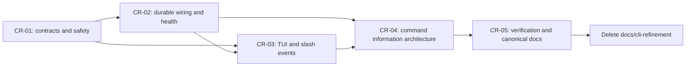

# ThinClaw CLI Refinement — Temporary Execution Dossier

> **TEMPORARY / NON-CANONICAL.** This directory is an implementation checklist, not product documentation. Execute it against the active ThinClaw checkout, absorb all durable facts into the canonical docs, and then delete `docs/cli-refinement/` in the final refinement commit. Do not retain it as a historical plan.

**Baseline:** ThinClaw `0.16.0`, commit `697118fb`, branch `release-please--branches--main--components--thinclaw`, audited and drift-reconciled 2026-08-01. Source anchors name symbols as well as files because line numbers will move during the refactor.

The re-audit from `e61c15a3` found no core CLI enum, Cargo feature declaration, setup-step, static-tool, dynamic-registration, channel-catalog, or gateway/OpenAPI route change. It did find the committed desktop agent-interface upgrade: desktop-managed child sessions are now correctly local-only while a remote profile is selected, fleet status no longer invents a current task, and local channel configuration explicitly reports that encrypted secret binding is unavailable. Those facts are incorporated below; the target must preserve the truthful gates while replacing hand-built desktop capability projections and the missing channel-secret binding with shared contracts.

The final sufficiency review also found parallel credential, process, and state-owner paths the first draft under-specified: repository-project CLI/agent/gateway plaintext values; gateway/Web/desktop provider, Nostr, MCP, and extension raw-secret forms; MCP stdio env values; extension tokens submitted through HTTP/WebSocket/free-form chat; experiment provider DTO mismatch/generic JSON; runner-profile secret-name/env maps; sender pairing codes in argv/output; experiment lease bearers embedded in argv/generated bootstrap/API/UI data; PostgreSQL `PGPASSWORD`; ambient child-environment/home/path inheritance; desktop vLLM/llama.cpp bearer tokens in process arguments; a secret-bearing generic desktop bridge overlay beside four uncompiled duplicate runtime-builder fragments; and direct durable writes that can leave an already-running cached service stale. D-19/D-39/D-49–D-54, CR-01.8, CR-02.1/CR-02.6/CR-02.7, CR-02.18, CR-02.20/CR-02.21, and files 05–07 now make their removals, typed replacements, ordering, and adversarial proofs mandatory rather than relying on a generic “redact secrets” instruction, keyword allowlist, or successful persistence alone.

## Outcome

The completed CLI must be an honest, safe operator surface over capabilities ThinClaw actually has:

- every ThinClaw durable or runtime-cached state mutation reaches the same domain service used by the runtime; explicitly external and process-lifecycle effects instead use their declared D-54 owner/policy and receipt contract;
- every success message represents an observable persisted or remotely accepted result;
- every mutation says whether it was applied to the live runtime, persisted for restart, or written while no runtime was active; an active cached-state owner is never bypassed by a direct-store fallback;
- command machine output is parseable, stable, banner-free, and free of ANSI; the deliberately raw help/version/completion parser-information exceptions are documented in D-48;
- setup is side-effect-free until reviewed Apply, never persists/prints secrets, and cannot overwrite unrelated files or silently mutate a user's `PATH`;
- public and hidden process protocols never carry credentials in argv/generated bootstrap text; every production child is descriptor-classified with sanitized environment plus explicit executable/home/temp/filesystem/network/isolation policy, durable consumers bind authorized source IDs, and ephemeral runner/local-inference auth uses a reviewed private delivery channel;
- TUI tools and approvals preserve request identity and use the runtime safety boundary;
- `status`, `doctor`, boot, `/tools`, and extension views consume the same exact revisioned tool/channel identities and distinguish configured, registered, available, exposed, and healthy;
- registry contention or name collision can never silently omit or replace a tool;
- common help is compact, while expert commands are grouped by user intent;
- compatibility aliases call the same implementation, warn only on human stderr, and have a dated removal policy;
- internal process entrypoints never appear in public help;
- canonical documentation is generated or verified against the command registry;
- this temporary dossier is removed after all acceptance gates pass.

This is a refinement, not a rewrite of functioning capabilities. Backup, reset, service management, updates, logs, models, identity/access, MCP, memory, repository projects, experiments, devices, and media generation remain. Their presentation and shared infrastructure change where needed.

## Document index

| Document | Purpose |
|---|---|
| [`00-current-state-and-disposition.md`](./00-current-state-and-disposition.md) | Complete audited inventory, current wiring, and final **KEEP / OVERHAUL / REMOVE / HIDE** disposition. |
| [`EXECUTION-PLAYBOOK.md`](./EXECUTION-PLAYBOOK.md) | Required order, shared-file rules, checkpoints, recovery, and verification commands. Start here during implementation. |
| [`01-cli-contract-safety-and-bootstrap.md`](./01-cli-contract-safety-and-bootstrap.md) | Output/exit contracts, bootstrap, flag scope, safe setup, shell removal, hidden internals, and shared gateway client. |
| [`02-persistent-wiring-capabilities-and-health.md`](./02-persistent-wiring-capabilities-and-health.md) | Persistent agents/conversations, routines/jobs, config, channels, memory, capability snapshots, status, doctor, and boot. |
| [`03-tui-and-slash-surfaces.md`](./03-tui-and-slash-surfaces.md) | Typed TUI events, approvals, tool correlation, history/rendering, startup state, slash registry, and layout cleanup. |
| [`04-command-information-architecture-and-migration.md`](./04-command-information-architecture-and-migration.md) | Target command tree, old-to-new mappings, compatibility lifecycle, help tiers, and completion behavior. |
| [`05-verification-doc-sync-and-self-removal.md`](./05-verification-doc-sync-and-self-removal.md) | Test matrix, canonical documentation updates, release gates, and mandatory deletion of this directory. |
| [`06-feature-command-and-output-matrix.md`](./06-feature-command-and-output-matrix.md) | Exhaustive leaf-command, build-profile, backend, platform, state-owner, dependency, mutation, and output contract. It is a cross-cutting acceptance input to CR-01…CR-05. |
| [`07-runtime-agent-and-channel-capability-matrix.md`](./07-runtime-agent-and-channel-capability-matrix.md) | Exact 124-name static agent-tool catalog, dynamic sources, CLI parity decisions, registry integrity contract, channel catalog, and final runtime assembly boundary. |
| [`08-setup-flow-page-and-secret-matrix.md`](./08-setup-flow-page-and-secret-matrix.md) | Exact 27-step setup audit, entry/continuation behavior, page consolidation, plan/apply transaction, secret handling, and setup acceptance fixtures. |

## Fixed decision register

These decisions are inputs to execution. Reopening one requires a written change to this dossier before code is changed.

| ID | Decision |
|---|---|
| D-01 | Terminal `agents` uses the durable `AgentRegistry`; no command constructs a disposable router. |
| D-02 | Public `sessions` becomes durable `data conversations`; it does not pretend process-local active sessions survive another invocation. |
| D-03 | Automatic PATH symlinking is removed from onboarding. Package managers/installers own installation. |
| D-04 | The raw TUI `!command` local-shell escape is removed. A future operator shell must use a separately reviewed, explicit unsafe/sandboxed design. |
| D-05 | TUI approvals are typed and request-ID-bound. Free-form input never implicitly approves, denies, or dismisses a pending request. |
| D-06 | `doctor` is an active, bounded diagnosis by default and exits `3` for required failed checks; operational failures remain exit `1`, and Clap keeps exit `2` for usage errors. |
| D-07 | `status` is a compact capability snapshot; `status --live` performs bounded probes. Static checks never masquerade as health. |
| D-08 | `cron` is renamed `automation routines`; `trigger` is shipped only when it creates a real run and returns its ID. |
| D-09 | Human and machine output share a typed presentation boundary. JSON/JSONL never contain branding, ANSI, warnings, or progress text. |
| D-10 | Runtime environment bootstrap executes exactly once before every immediate terminal command. |
| D-11 | Only `--debug`, `--config`, `--output-format`, `--color`, `--quiet`, and `--verbose` are truly global. `--config` is resolved centrally and honored by every command that loads state; runtime-specific flags are scoped. |
| D-12 | `--channels none\|configured\|<csv>` replaces ambiguous `--cli-only`; the old flag is a hidden compatibility alias for `none`. |
| D-13 | Configuration uses a two-phase source-aware resolver: bootstrap/infrastructure settings are resolved without the database, then mutable runtime preferences are hydrated from the database and overlaid by TOML/environment/leaf overrides. Secrets are managed by `config secrets`; general config commands reject sensitive paths and never echo secret values. |
| D-14 | Channel static validation is named `check-config`; `probe` performs live checks. |
| D-15 | One final multidimensional `CapabilitySnapshot` drives status, doctor summaries, boot, and TUI startup. Compile, configuration, registration, dependency, exposure, approval, and health are independent facts rather than a false linear stage. |
| D-16 | One command registry describes slash commands, aliases, capability predicates, authorization, visibility, and handlers for REPL, TUI, and agent-message routes. |
| D-17 | Internal workers/bridges/runners remain executable for their orchestrators but are hidden from all user help and generated docs. |
| D-18 | One hardened `GatewayClient` serves CLI HTTP consumers, including send, devices, experiments, routine triggers, and jobs. |
| D-19 | Existing public names remain hidden aliases for two minor releases unless they are unsafe or dishonest. Unsafe shell/PATH behavior and plaintext secret arguments/protocols such as `secrets set --value`, repository-project `set-credential --value`, sender pairing codes, experiment-runner `--token`, and extension HTTP/WebSocket/chat token submission are removed immediately; fake routine trigger and ephemeral state handlers cannot remain as fallbacks. |
| D-20 | The final accepted commit deletes this entire directory. Durable behavior belongs only in canonical docs and generated help. |
| D-21 | Global presentation uses `--output-format human\|json\|jsonl`; `--output` is never reused globally because existing commands use it as an artifact path. Canonical artifact destinations use `--out`. |
| D-22 | Stable public exit classes are `0` success, `1` operational/internal failure, `2` Clap usage/parser failure, `3` completed diagnosis/live status with required unhealthy checks, and `130` user interrupt. Supervisor restart code `75` remains internal. |
| D-23 | Database selection is compile-aware: a single compiled backend is the default; selecting an uncompiled backend is an error and never silently falls back. Dual-backend 0.17/0.18 builds retain warned PostgreSQL compatibility only when no source selects a backend; setup/config writes an explicit choice. In 0.19, a fresh/unmigrated dual-backend configuration without an explicit choice is an error. |
| D-24 | Local REPL and TUI are supported in every valid host build profile. OS service management and the Windows SCM entrypoint are decoupled from the misleading `repl` feature gate. In 0.17, `repl` becomes an empty deprecated compatibility feature and is removed from the `desktop`/`full` aggregates; no `cfg(feature = "repl")` may control code. Remove the feature declaration in 0.19. |
| D-25 | The first jobs CLI ships bounded snapshot event reads with `--limit`/`--after`; it does not advertise `--follow` until a real cursor/reconnect streaming contract exists. Job file reads are bounded UTF-8 text, not arbitrary byte streams. |
| D-26 | `runtime web access` is redacted by default. Explicit token reveal is TTY-confirmed, never available in machine output, never logged, and never included in boot/TUI state. |
| D-27 | Model discovery is non-billable by default. A chat probe is explicit (`--chat-probe`) and requires interactive confirmation or `--yes`; `models test MODEL` remains an explicit minimal remote/billable action. |
| D-28 | Full reset has exact repeatable scopes (`database`, `files`, `credentials`) plus `all`, supports `--dry-run`, requires an exclusive stopped-runtime lease, and never uninstalls the binary or service definition. |
| D-29 | `edge`, default/light, desktop, full, minimal-libsql, minimal-postgres, all-features, release-full, and release-edge are supported contracts with help/capability snapshots—not compile-only best effort. Test-only features never appear as runtime capabilities. |
| D-30 | Agent-tool parity is selective, not one-command-per-tool. Operator lifecycle/data controls share domain services; execution primitives remain agent-only but are visible with exact provenance/readiness through `status tools`. The 124 static IDs and every dynamic source are governed by file 07. |
| D-31 | Tool registration is origin-aware and collision-deterministic. No `try_write` omission or implicit overwrite is permitted; static reserved names come from the same typed catalog as capability descriptors, and intentional rebinds are explicit outcomes. |
| D-32 | Explicit `setup` applies configuration and exits. `setup --run` is the opt-in REPL continuation; automatic first-run setup resumes the exact originating Run/TUI/Ask request. Setup renderer choice never changes runtime intent. |
| D-33 | Setup is draft → review → apply. Profile/quick defaults, DB migrations, secure-store writes, per-step persistence, and extension installation cannot mutate durable state before explicit Apply; Back/Cancel before Apply is side-effect-free. |
| D-34 | Setup never generates-and-prints a master key, stores secret values in `.env`/serializable settings, or prints a gateway token URL. The master key and pre-DB host credentials use a direct local OS-credential/env/private-file source. Masked/generated provider, channel, and gateway credentials default to the existing encrypted `SecretsStore` protected by that master key; an explicitly selected env/private-file source remains external and is represented only by its authorized source record. Headless input can select a pre-created source ID but cannot create a host source. Runtime settings persist opaque secret-source bindings only. |
| D-35 | One typed channel catalog supplies setup, CLI, runtime activation, web settings, snapshots, and docs. It includes native/lifecycle/bundled/installed variants, resolves overlapping driver IDs explicitly, and makes `--channels none` disable all nonlocal ingress including gateway and WASM. |
| D-36 | The startup capability snapshot is emitted only after final scheduler/job, subagent, LLM/advisor, persistent-agent, routine, channel, and configured dynamic-extension assembly. Later hot changes increment and publish a snapshot revision. |
| D-37 | Exact capability reconciliation adds only three operator parity areas: kind-aware extension lifecycle activation (while repairing the existing auth/list/remove agent contract), guarded memory deletion, and deep `data learning` administration. Authentication no longer auto-activates and manual extension secrets never arrive through an ordinary gateway/WebSocket/chat payload. Outbound messaging, prompt/skill self-mutation, subagents, sensors, desktop autonomy, and execution primitives remain conversational tools. |
| D-38 | `data learning` covers the existing gateway ledger/admin API as well as agent-tool parity. Static reads never probe providers; list cursors are usable; proposal approval/evaluation are previewed and gated; rollback recording is not presented as artifact restoration; external-memory credentials are out-of-band `SecretSourceId` bindings and never inline tool/CLI JSON. |
| D-39 | Mutable runtime credential settings persist only `SecretBinding { source_id, purpose }`: an opaque `SecretSourceId` plus its schema-declared purpose. A durable principal/purpose-scoped `SecretSourceRecord` maps that ID to one `SecretSourceRef`: existing encrypted `SecretsStore` name, schema-authorized OS credential-store account, environment-variable name, or operator-owned private regular-file path. Persist the locator payload encrypted/authenticated at rest while keeping only safe ID/owner/kind/canonical-purpose/revision metadata queryable. The existing `thinclaw_secrets::SecretRef` is metadata for an encrypted database secret—not an OS-keychain reference—and is not reused as a catch-all. Pre-DB Phase-A fields may use the same direct enum in private local bootstrap configuration but never depend on the DB source registry and are never remotely bindable. Runtime resolution is centralized and values never enter settings/API DTOs. |
| D-40 | External-memory configuration is a zero-network durable write; activation is an explicit live-runtime action; deactivation is named truthfully and preserves configuration. Provider configured/enabled/active/healthy/scope-safe states remain independent. Letta stays configurable/inspectable but cannot activate until it enforces actor/conversation isolation. |
| D-41 | `status tools` and local `/tools` use the same population rules: registered entries by default, an exact named lookup may resolve any catalog entry, and `--all` includes all catalog/installed dynamic descriptors. Both render one immutable snapshot revision. The terminal subcommand adds independent fact filters; it has no synthetic linear `--state ready\|unavailable`. |
| D-42 | Every proof token in files 06–08 resolves to a concrete test or parameterized case ID in a checked coverage manifest; wildcard proof claims are forbidden. The temporary dossier itself must parse as valid GFM with consistent table widths and valid local links before execution and before deletion. |
| D-43 | Every “bounded” network, file, pagination, queue, preview, or retention claim resolves to a named constant and boundary test. Preserve an existing stricter cap; otherwise use the task defaults. No unbounded fallback, naked timeout literal, or silent truncation is permitted. Human and machine results disclose truncation/pagination without exposing discarded secret material. |
| D-44 | `status`/`doctor` use `--readiness-profile`, not overloaded `--profile`. Canonical values are `server`, `remote`, `desktop`, `pi-os-lite-64`, and `all-features`; default is `server`. The old flag and `desktop-linux`/`desktop-gnome` values are hidden aliases through 0.18. Readiness profile, setup profile, and compiled build profile remain distinct typed fields. |
| D-45 | Empty Cargo features are compatibility aliases, not capabilities. In 0.17 remove `repl`, `web-gateway`, and `timezones` from every aggregate and ensure no source `cfg` consumes them; retain empty deprecated declarations for downstream builds through 0.18, prove enabling them changes no metadata/help/capability snapshot, and delete the declarations in 0.19. |
| D-46 | Desktop-managed child-session operations remain explicitly local-only. Selecting a remote profile returns the existing typed `LocalOnly` capability gate and performs no embedded-runtime fallback or mutation. Agent-level subagent tools remain separate conversational capabilities; any future remote child-session dispatch requires its own authenticated, profile-targeted contract. |
| D-47 | Channel credential editing uses the shared secret-source contract. Local CLI/setup may create or select a validated source; gateway/desktop clients submit only an opaque host-authorized `secret_source_id`. Until that adapter is live, desktop must continue to report `secret_binding_available=false` and disable credential editing—it must never fall back to plaintext password settings. |
| D-48 | Clap parser information actions are an explicit raw-text exception: `-h/--help`, `help ...`, and `-V/--version` write deterministic informational text to stdout, return `0`, perform no bootstrap/state/network work, and are never JSON-wrapped even if `--output-format` is also present. They contain no banner/progress/deprecation text; color follows the effective color policy. Completion scripts remain raw artifacts. |
| D-49 | No public or hidden ThinClaw process entrypoint carries a bearer secret, passphrase, sender code, or credential value in argv, generated shell text, ambient/unclassified child environment, provider user-data, ordinary admin/config DTOs, results, or logs. Public configuration selects an authorized `SecretSourceId`; deliberate local creation uses masked/stdin/private-source input. Narrow authentication protocols keep non-serializing/redacted types and named transports. Prefer stdin/private files/native secret mounts; a schema/manifest-declared subprocess env slot (for example an MCP stdio server that requires one) may receive only its exact resolved value after ambient secret variables are removed, with no shell/log/debug copy. The only deliberate user-facing secret deliveries are guarded gateway/device-pairing display and the private one-use experiment auth artifact; the experiment runner consumes that envelope through stdin/private artifact or a managed platform secret channel, and sender approval uses the non-secret pending request ID. |
| D-50 | Every production child launch is mediated by a typed `ProcessLaunchDescriptor` and checked process-launch manifest. The launcher clears ambient environment and applies explicit executable/PATH, home, temp, cwd/filesystem, network, isolation, I/O/deadline, descendant-tree, cleanup, and reviewed credential-slot policy. Real operator `HOME`, inherited `PATH`, and shared temp are never a universal baseline. Untrusted work receives a launcher-owned synthetic home/temp plus sandbox/container/dedicated-user policy; explicitly approved arbitrary host execution is labeled `host_unconfined`, receives no general secret grant, and is never presented as isolation. A fixed `reviewed_direct_host` consumer may receive only its declared private sink/slot and is likewise not called sandboxed. Raw process construction is confined to platform launchers/adapters/tests. Desktop inference bearers use an inherited pipe or private auth file through a pinned backend adapter and never cross renderer/API DTOs; a backend without that proven transport is unavailable rather than launched with `--api-key`. |
| D-51 | Desktop runtime assembly has one compiled modular source path. The tracked extraction modules are wired and the duplicated monolithic regions removed (or the orphan files are deleted if equivalence cannot be established); CI proves no compiled-adjacent orphan remains. `BRIDGE_VARS`/env-like string maps carry non-secret typed overrides only. Gmail, gateway, LLM, MCP, channel, and other credentials enter their owning service through purpose-authorized opaque handles, never a cloneable generic map. |
| D-52 | Extension authentication is an owner/kind/extension-bound expiring session with exactly one effect. OAuth uses server-side PKCE exchange; manual auth binds a purpose-authorized `SecretSourceId` created through local secure ingress. Delete `/api/chat/auth-token`, WebSocket `AuthToken`, and free-form pending-auth token capture immediately. Remote clients without OAuth or a pre-created source fail `secure_input_unavailable`; successful auth returns `next_action=activate` and never activates implicitly. |
| D-53 | Every secret-like field or transport candidate is classified in the checked credential manifest as `source_bound`, `bootstrap_direct`, `ephemeral_internal`, `protocol_sensitive`, `deliberate_reveal`, or `non_secret_semantic`. Mutable credentials use durable `source_bound` `SecretPurpose` bindings; pre-DB Phase-A values alone use local `bootstrap_direct` refs. The other classes require their own owner, transport/storage/retention/redaction, and proof contract. There is no keyword-only ignore list, and a name such as `token` is never enough either to exempt a field or to treat a pagination cursor as a credential. |
| D-54 | Every mutating leaf declares `MutationExecutionPolicy = embedded_runtime \| durable_immediate \| active_coordinated \| runtime_required \| stopped_exclusive \| owned_process_lifecycle \| external_direct`. Finite mutation results carry one idempotent request ID, the applicable durable/runtime/external operation revisions/IDs, and an exact application state; long-running embedded surfaces emit the equivalent lifecycle events. If an owned runtime is active, `active_coordinated` mutations must use its authenticated shared service and cannot fall back to a fresh direct-store service when unreachable. Setup/reset/import are stopped-exclusive. Partial persist/apply failures are typed and never reported as live success. |

## Workstreams and dependency graph

| Workstream | Scope | Depends on |
|---|---|---|
| CR-01 | CLI contract, bootstrap, safety boundary, client infrastructure | — |
| CR-02 | Durable wiring, capability model, health/readiness | CR-01 |
| CR-03 | TUI event model, approvals, rendering, slash surfaces | CR-01, CR-02 capability types |
| CR-04 | Public information architecture and compatibility migration | CR-01, CR-02 shared handlers, CR-03 registry |
| CR-05 | Full verification, canonical doc sync, dossier deletion | CR-01…CR-04 |

Files 06–08 are not additional implementation waves. They are the audited leaf/profile, runtime-capability/channel, and setup/page ledgers that every workstream must keep green. If implementation changes a row or identity, amend the relevant matrix and owning task in the same commit before continuing.

Task-level sequencing exception: CR-01.10 setup apply depends on the resolver/backend primitives in CR-02.6/CR-02.13, the descriptor-backed process boundary in CR-02.20, the shared service construction in CR-02.1, the channel catalog/credential schema in CR-02.7, and the single typed desktop assembly path in CR-02.21. Execute CR-01.1…CR-01.9, then those foundations, then CR-01.10 before the remaining CR-02 work, exactly as the playbook ledger states. Workstream numbers are ownership labels, not permission to introduce a dependency cycle.



## Completion invariant

The work is complete only when every task ID in the numbered workstreams is checked, every row in the disposition inventory has its target state, every row/identity in files 06–08 and the checked credential-consumer/process-launch manifests has implementation and proof, all required tests pass, canonical docs reflect the shipped interface, deprecated aliases are covered by tests, and:

```bash
test ! -e docs/cli-refinement
```

passes on the final implementation branch. If the directory still exists, the refinement is not done.
